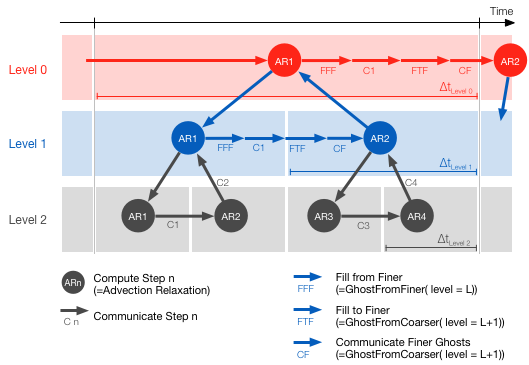

title: Description of the Multi-Level Algorithm

# Introductory Comments

Here we describe the recursive processing of the level-wise sorted list of
elements through the kernels.
From the mesh on disk, which was stored as treeIDs, a level-wise collection
of element lists are created before the computation can be started. These
lists include ghost and halo cells to account for elements which are missing
locally but are calculated on a remote partition as well as missing neighbor
elements due to level interfaces.
A detailed description of the mesh generation process and the employed data
structures can be found [here](doc_pages/features/data_struc.html).


All levels are updated starting from the coarsest, updating all schemes. For
each scheme the following procedure is performed. First, the double buffer index
is swapped and the boundaries are set. Then the flow field is computed for the
current timestep (for this level and this scheme). Next, communication with
adjacent partitions for current level is performed. If multiple levels are
present, a recursive part is entered. On a level `n, 2*(n-1)` times the
timesteps of the coarsest level have to be computed. Therefore, the compute
routine is called twice for the next finer level. Afterwards, the ghost elements
have to be updated again to provide valid values for the fluid elements. First,
the coarse ghost elements are updated from fluid elements on the finer level,
then they have to be communicated. Same applies for the finer ghost elements.
After all schemes and levels are done, a routine handling output, check and
restart is called and the timestep is updated.

```Fortran
recursive subroutine compute( iLevel )
  compute_kernel
  if( iLevel < maxLevel)
    recursive call compute( iLevel+1 )
    comm FromCoarser
    recursive call compute( iLevel+1 )
    fillFromFiner
  endif
  comm FromFiner
  comm
  if( iLevel < maxLevel)
    fillFromCoarser( iLevel+1)
    comm FromCoarser( iLevel+1)
  endif
end subroutine compute
```


