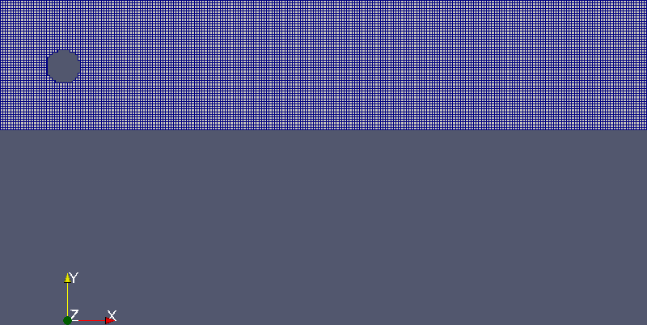
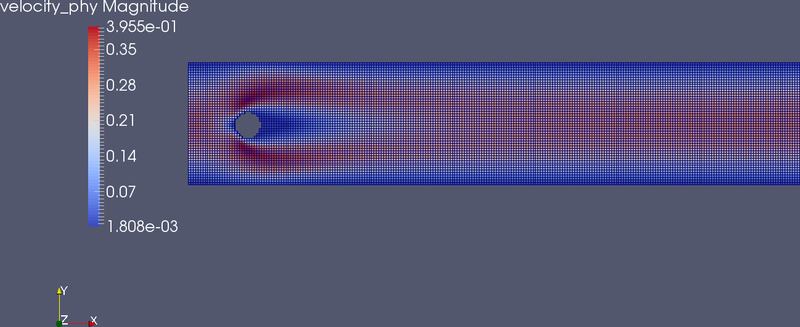
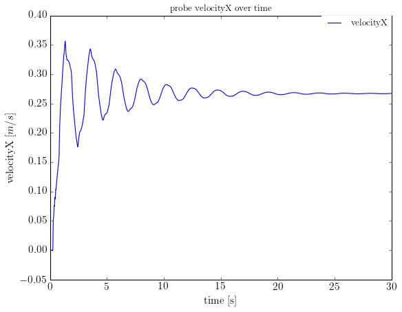
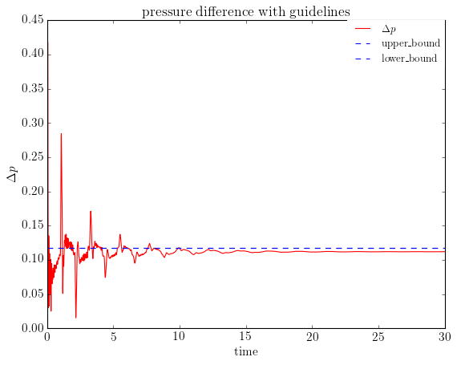

title: Steady Flow Around Cylinder 2D

Navigate: [&larr; Test case Flow Around Cylinder 2D](tut_cylinder.html)
| [Unsteady Flow Around Cylinder 2D &rarr;](unsteady.html)

# Simulation of the steady flow

We would like to use the whole apes suite. This means that we are going through
a few steps:

* We create a mesh in Seeder, containing the channel and the obstacle (sphere
  or cylinder, which depends on the testcase).

* We visualize the mesh with Harvester and have a look at it in Paraview.

* We create a simulation file for Musubi and find out when the simulation gets 
  stable. Plot the results with Gleaner.
  \note We use Gleaner inside our group which is based upon the free available
  matplotlib. You can use

* If we have reached a steady status, we track the needed variable values in 
  order to get results.

* The results can be plotted with Gleaner and shall be sum up at the end.

> This test case is available in the repository in the 
> `tutorial/testcases/FlowAroundCylinder/`. 

### Conditions provided by the test case

In the 2D test case for a steady flow around a cylinder we use a Reynolds number
of \(Re=20\) . We have a kinetic viscosity of 
\(\nu = 0.001\frac{m^{2}}{s} \) and a fluid density of 
\( \rho = 1\frac{kg}{m^3} \) .
The mean velocity is given with \( U_{m}=0.3\frac{m}{s} \). 
The geometry information is given in the above image that displays a sphere 
inside of a channel.
Although the length is given by 2.2 m, we will run the simulation with different
ratios between length and height of the channel in order to have a look at the 
influence on the tracked variable values. We will call it `l_h` in the code.


We calculate the mean velocity \( \bar{U} = Re\frac{\nu}{D} \) and call it 
`u_mean_phy` and the incoming velocity 
\( U_{m} = \frac{3}{2}\bar{U} \) and call it `u_in_phy`.

We also define a variable to check the Reynolds number.
After that, we calculate the physical pressure which depends on the physical 
density in the solver.
The function for the incoming velocity of the flow is given in the paper 
"Benchmark Computations of Laminar Flow Around a Cylinder" by M. Schaefer and 
S. Turek for the steady test case with:

\( U(0,y,t)=\frac{4*U_{m}*y*(H-y)}{H^{2}}, V=0 \)

Therefore we might start, creating a file containing all the information about 
the physical conditions of the fluid and the convertion between physical and 
lattice units and basics that can be used in both files, seeder.lua and 
musubi.lua. This is done in the following.

# common.lua, units.lua, printSimParam.lua

In order to separate things and to get a better overview of the simulation files
it is recommend to create a common.lua file containing all the information 
dealing with physical and lattice boltzmann units. Here, we can define variables
and functions that are needed for the whole package of seeder, harvester and 
musubi.

In this test case we have to set up variables concerning refinement, geometry, 
physics and fluid.

We write down everything we know from the provided conditions.

```lua
minrefine = 1   
maxrefine = 3
-- --------
-- geometry
-- --------
height      = 0.41
nHeight     = 64    
l_h         = 5    
nLength     = nHeight*l_h 
dx          = height/nHeight
length      = nLength*dx
nLength_bnd = nLength+2
level       = math.ceil(math.log(nLength_bnd)/math.log(2))
length_bnd  = (2^level)*dx
dx_half     = dx*0.5
zpos        = dx_half
sph_pos     = {0.2,0.2,zpos}
radius      = 0.05
Dia         = radius*2.0
```

In the above code, nHeight and l_h defines number of elements along height and 
length to height ratio respectively.

In the steady flow simulation (Re = 20), l_h = 5 (fixed) and 
nHeight = 50,100,150,200,300,400. A higher `nHeight` refines the mesh so that 
the simulation will be more exact. 

Then we write down the flow parameters which are known and which have to be 
calculated.

```lua
-- ---------------
-- flow parameters
-- ---------------

Re          = 20
nu_phy      = 1e-3 --m^2/s
rho0_p      = 1.0
u_mean_phy  = Re*nu_phy/Dia
u_in_phy    = 3.0*u_mean_phy/2.0

nL          = math.ceil(Dia/dx)
Re_check    = u_mean_phy*Dia/nu_phy
rho0_l      = 1.0
cs2_l       = 1./3.
p0_l        = rho0_l*cs2_l
```


For acoustic scaling we fix the speed of sound and compute omega:

```lua
if acoustic_scaling == true then
  -- ----------------
  -- acoustic scaling
  -- ----------------
  
  cs    = 343.0 -- m/s
  cs_L  = math.sqrt(1.0/3.0)
  dt    = cs_L * dx / cs_phy
  nu_L  = nu_phy*dt/dx^2.
  omega = 1.0/(3.0*nu_L+0.5)

```

And for diffusive scaling it is the other way round, we fix omega and compute 
the lattice incoming velocity.
And on the other hand for diffusive scaling, we fix omega and compute the speed
of sound:

```lua
else
  -- -----------------
  -- diffusive scaling
  -- -----------------
  
  cs_L  = math.sqrt(1.0/3.0)
  omega = 1.9 --os.getenv('omega')
  nu_L  = (1.0/omega-0.5)/3.0
  dt    = nu_L*dx^2/nu_phy
  cs    = cs_L * dx/dt

end
```

Note that the actual relevant setting for Musubi here is only either
`cs` or `dt`. With `cs` taking precedence if both are defined in the
physics table.

> To get better results, we could also change the Mach number which is a 
> division by the lattice velocity over the square root of the lattice stream of 
> sound.
> Therefore we have to change the omega value. `omega` leads to `nu_L`, `nu_L` 
> leads to `dt` and `dt` leads to `u_in_L`. So changing omega means changing 
> lattice velocity. 
> This is for diffusive scaling.

```lua
MachNr = u_in_L/math.sqrt(cs2_l))
```

The initial pressure is dependent on the density and the computed values for dx
and dt.

```lua
press_p = rho0_p*dx^2/dt^2
p0_p = press_p--*cs2_l
```

In the paper mentioned above, the velocity of the flow is given by this space 
time function that is the last line of common.lua:

```lua
function u_inflow(x,y,z,t) 
  return 4.0*u_in_phy*y*(height-y)/height^2.0
end
```

There is another file that we call `units.lua`. There we write down the lattice units:
```lua
require "common"

l_lp  = dx
t_lp  = dt
u_lp  = dx/dt
nu_lp = dx^2/dt
csSqr = 1.0/3.0
pr_l  = csSqr
pr_lp = (dx/dt)^2*rho0_p
```

We also could write a lua script that prints all the necessary 
variable values for a documentation of the results later on.

We could call it `printSimParams.lua`
It just prints all the values to the screen. It looks like this:

```lua
require "common"
require "units"

print('##Physical parameters##')
print('Re =', Re)
print('Re_check =', Re_check)
print('u_in_p =', u_in_phy)
print('u_mean_p =', u_mean_phy)
print('nu_p =', nu_phy)
print('rho0_p =', rho0_p)
print('length_bnd =', length_bnd)
print('length =', length)
print('height =', height)
print('Dia =',Dia)
print('dx =',dx)
print('dt =',dt)
print('u_lp =',u_lp)
print('pr_lp =',pr_lp)
print('pr_l =',pr_l)
print('level =', level)
print('')
print('##Lattice parameters##')
print('nLength =', nLength)
print('nLength_bnd =', nLength_bnd)
print('nHeight =', nHeight)
print('nDia =', nL)
print('nElems =', nLength*nHeight)
print('nSteps =', nSteps)
print('u_in_L =', u_in_L)
print('u_mean_L =', u_mean_L)
print('nu_L =', nu_L)
print('omega =', omega)
```

After finishing this additional file we can go on with the main files for seeder
and musubi. 

# Seeder
   
We use Seeder in order to generate the mesh for our simulation of the flow 
around a cylinder. 
The goal is to create a channel with a cylinder inside. The cylinder is regarded
as an obstacle and is placed vertically to the sidewalls of the channel. Because 
of the 2d case, we can use a sphere.

We have to build a seeder.lua file containing the following aspects:

* folder
* debug table
* bounding_cube table
* spatial_object table

These are the basic things we need in this file. Because of the fact, that we 
created a file common.lua with physical and technical information about the 
simulation we need to make sure that seeder.lua gets its information.

We do this with: 

```lua
require "common"
```

Normally, we make a directory called "mesh" for the seeder output. This is the 
location for the mesh which we define with:

```lua
folder = 'mesh/'
```

For debugging cases we are able to define a debug table. We have to activate the
debugMode and the debugFiles.
Before we run seeder.lua later on, we make sure that we create a directory 
called 'debug' in the same folder where seeder.lua is located.

```lua
debug = {debugMode = true, debugFiles = true}
```

Now, we can define the bounding_cube table. The bounding_cube is a single 
element of the mesh. We need to define the origin and the length of a single 
edge. After that we have done this, we set up a variable named `minlevel` that 
we need later on in musubi.lua.

```lua
bounding_cube = {origin = {-dx/1.,-dx/1.,-dx/1.},
                 length = length_bnd}
minlevel = level
```

Then we go on with the spatial_object table where we define the seed, the 
outside boundaries and the obstacle that is also a boundary.
A spatial_object is defined by its attribute table with kind and label and by 
its geometry table containing the kind and the object.

To have a look at the seed, it is important to place it inside of a fluid 
element. It cannot be placed onto a boundary. The seed is a simple point in the
fluid mesh where the flood begins to spread in every direction.
At first, we open the spatial_object table and go on with every attribute. For 
example, the seed is an attribute.

So we can define the seed like that:

```lua
spatial_object = {
  {
    attribute = { 
      kind = 'seed',
    },
    geometry = {
      kind = 'canoND',
      object = {
        origin = { length*0.5, height*0.5, zpos },
      }
    }
  },
```

After that, we define the four boundaries of the 2D channel. To have a good 
overview, we can give them labels like 'north', 'south', 'west' and 'east'. 
These boundaries are planes which are defined by the origin and two vectors.
Planes are also of kind 'canoND'. Each plane is one another attribute in the 
spatial_object table.

```lua
  {
    attribute = {
      kind = 'boundary',
      label = 'north'
    },
    geometry = {
      kind = 'canoND',
      object = {
        origin = { -dx,height+dx_half,-dx },
        vec = {{length+4*dx,0.0,0.0},
               {0.0,0.0,4.*dx}}
        }
    }
  },
  {
    attribute = {
      kind = 'boundary',
      label = 'south'
    },
    geometry = {
      kind = 'canoND',
      object = {
        origin = {-dx,-dx/2.,-dx},
        vec = {{length+4*dx,0.0,0.0},
               {0.0,0.0,4.*dx}}
        }
    }
  },
  {
    attribute = {
      kind = 'boundary',
      label = 'east'
    },
    geometry = {
      kind = 'canoND',
      object = {
        origin = {length+dx/2.0,-dx,-dx},
        vec = {{0.0,height+2*dx,0.0},
               {0.0,0.0,4.*dx}}
        }
    }
  },
  {
    attribute = {
      kind = 'boundary',
      label = 'west'
    },
    geometry = {
      kind = 'canoND',
      object = {
        origin = {-dx/2.0,-dx,-dx},
        vec = {{0.0,height+2*dx,0.0},
               {0.0,0.0,4.*dx}}
        }
    }
  },
```

Because of the fact, that there are the same boundary conditions along the 
z-axis, we make use of periodic boundaries ('usePeriodic')which is defined in 
common.lua. This is the reason why we define an attribute which is periodic. The
object is defined by two planes.

```lua
  {
    attribute = {
      kind = 'periodic',
    },
    geometry = {
      kind = 'periodic',
      object = {
        plane1 = {
          origin = {-dx,-dx,dx+dx/2.0},
          vec = {{length+4*dx,0.0,0.0},
               {0.0,height+2*dx,0.0}}
        },
        plane2 = {
          origin = {-dx,-dx,-dx/2.0},
          vec = {{0.0,height+2*dx,0.0},
                 {length+4*dx,0.0,0.0}}
        }         
      }  
    }
  },
```

The last attribute in this case is the definition of the obstacle which is a 
cylinder in 3D and a sphere in 2D. Therefore, we need to define the object by 
origin and radius. The geometry kind is the special kind 'sphere'.

```lua
  {
    attribute = {
      kind = 'boundary',
      label = 'sphere'
    },
    geometry = {
      kind = 'sphere',
      object = {
        origin = sph_pos,
        radius = radius
      }
    }
  }
}
```

Run Seeder with 

```lua
~/apes/seeder/build/seeder seeder.lua
```

to get a mesh in the folder you have chosen. You can check your mesh using 
Paraview. 
Therefore write a harvester.lua script. 

## Visualisation of the mesh

To have a look onto the mesh in Paraview, we create a harvester.lua file that 
converts the mesh information into VTU format. Therefore, we need to define 
certain information. These are 

* simulation_name
* input
* output

We use 'FlowAroundCylinder2D' as simulation_name for example. To define the 
input, we have to set `mesh` to the location of the mesh files. To define the 
output we need the location where harvester shall dump the VTU and PVTU files. 
In addition to that we define the format as VTU and give a label like 'mesh' for
example.

```lua
simulation_name = 'FlowAroundCylinder2D'
input = { 
  mesh = './mesh/'
}
output = {
  folder = 'mesh/',
  {
    label = 'Sim_mesh',
    format = 'VTU'
  }
}
```

Now run Harvester with
```lua
~/apes/seeder/build/sdr_harvesting harvester.lua
```
to get the VTU file and open it with Paraview.
The mesh looks like this:


# Musubi

You have a generated mesh now that can be used in musubi.lua. While you write 
the script for Musubi, you might have a look at the tutorials for Musubi if you
feel unsure about the context.

## general information

We want to simulate the pressure drop, the lift and drag coefficient and the 
recirculation length as mentioned above. 
Therefore we need to track the pressure over time at two points, one at the 
beginning and one at the ending of the obstacle. 
The difference between these pressure values will be plotted over time. 

## Which tracking variable values are needed for each quantity pressure 
## difference, recirculation zone, drag coefficient, lift coefficient?

The following refers to Gleaner which is software we use in our group.
Instead you can use Gnuplot, Matlab or matplotlib of python.

* pressure difference
  
  We need pressure_phys over time at two points. It will be plotted with 
  Gleaner.

* recirculation zone

  We need velocityX over length. Using the resulting ascii spatial file 
  in Gleaner we can compute it there.
  
* drag coefficient and lift coefficient

  We need to track the forces at the obstacle (sphere). It is directly possible
  to compute the coefficients in the tracking table. The results are dumped in 
  ascii file format.

A stable simulation is reached, if the pressure over time will reach a straight
line. Therefore plot it with Gleaner first.
In addition to that or instead, you can use the steady state criteria in 
musubi.lua that is described later on.

## preparations for the simulation

So we start with creating directories for tracking, output and restart. The 
names are free to choose, but in this tutorial we call them 'tracking', 
'output' and 'restart'. Make sure that these directories are located in the same
level like 'musubi.lua'. We have to do this every time we start a new simulation
so that it might be helpful to create a template which automatically creates 
directories that are needed to run the simulation progress. Therefore we use 
Shepherd.

```lua
mkdir debug tracking restart output mesh
```

## general musubi settings

Because of the fact that we wrote all the physical terms down in common.lua 
we have to call it here.

```lua
require "common"
```

The *boundary conditions* used at the inlet and outlet are

* inflow BC: inlet_ubb
* outflow BC: outlet_expol, outlet_eq, outlet_dnt, outlet_pab
* outlet_expol - extrapolation boundary
* outlet_dnt - do-nothing
    * both outlet_expol and outlet_dnt from "Asymptotic Analysis of Lattice 
      Boltzmann Outflow Treatments, Junk, Michael Yang, Zhaoxia,Communications 
      in Computational Physics, 2011.
* outlet_eq - equilibrium boundary from "Analysis of open boundary effects in 
  unsteady lattice Boltzmann simulations, Izquierdo, Salvador, Martínez-Lera, 
  Paula Fueyo, Norberto, Computers & Mathematics with Applications, 2009.
* outlet_pab - pressure anti-bounce back
* inlet_ubb - velocity bounce back
    * both outlet_pab and inlet_ubb from "Characteristic nonreflecting boundary
      conditions for open boundaries in lattice Boltzmann methods, Izquierdo, 
      Salvador Fueyo, Norberto,Physical Review E 2008.

You can find short information about the boundary_condition inlet and outlet 
kinds at the [Documentation](../tut_4_boundaries.html).
(Four different boundary conditions are used for this testcase and their 
comparison results are shown in the corresponding tickets steady flow #915 and 
unsteady flow #916.)

As we make use of different inlet and outlet kinds, we define the currently used
kind in the beginning of the file as a variable which is called in the tracking 
table.

In addition to that it is necessary to distinguish between the used test cases 
with different file names. We also define the tracking, the mesh and the restart
folder in the beginning. 
In the following code, we can see the basic information for musubi.

```lua
-- --------------------------
-- Musubi configuration file. 
-- --------------------------

require "common"

inlet   = 'ubb'
outlet  = 'expol' --os.getenv("outlet")

if Re == 20 then
  tracking_fol = 'tracking/Re20/'
  restart_fol = 'restart/Re20/'
elseif Re == 100 then
  tracking_fol = 'tracking/Re100/'
  restart_fol = 'restart/Re100/'
end

-- ---------------
-- Simulation name
-- ---------------

simulation_name   = 'FlowAroundCyl'
mesh              = 'mesh/' -- Mesh information
printRuntimeInfo  = false
control_routine   = 'fast'
io_buffer_size    = 10 -- default is 80 MB

```

## sim_control

After that, we define the time step settings which is done inside the 
sim_control table. We have to define the maximum time, the interval between 
different time steps and an abort_criteria in order to finish the simulation as
a steady_state has been reached.

```lua
-- -----------------
-- Time step settigs
-- -----------------

tmax        = 10      -- real time in seconds
interval    = tmax/10
sim_control = {
  time_control = { 
    max = tmax,
    interval = interval
  }, -- time control
  abort_criteria = {
    stop_file     = 'stop',
    steady_state  = true,
    convergence   = {
      variable = {'pressure_phy'}, 
      shape = {
        {kind = 'canoND', object = {origin ={0.15-dx,0.2,zpos} }},
        {kind = 'canoND', object = {origin ={0.25+dx,0.2,zpos} }}
      },
      time_control = {min = 0, max = tmax, interval = 10*dt},
      format    ='convergence',
      reduction = {'average'},
      norm      = 'average', 
      nvals     = 50, 
      absolute  = true,
      condition = { threshold = 1.e-10, operator = '<=' }
    }
  },
} -- simulation control
```

## restart

This is followed by the *restart* table where we have the possibility to save our simulated results and resume a simulation
from a certain time step. For the first run, the restart files are not existing so far. We have to write them first. This is
why in the following code, the read statement is deactivated.

```lua
-- -------
-- restart
-- -------

restart = {
      ead = restart_fol..'channel2D_lastHeader.lua',
      write = restart_fol,
      time_control = { min = 0, max = tmax, interval = interval}
 }
```

You can find more information about the restart table in the [Documentation tutorials](../tut_5_restart.html).

## physics

In the next part, we have to give information about the *physics* and the 
*fluid*. In the physics table we define the physical reference values in SI unit
system. You can find all the possible variables in the Documentation for Musubi.
They belong to the mus_physics_module. It is the mus_physics_type. 
Have a look at [[mus_physics_module:mus_physics_type]].

In this test case we have information about the reference time and the reference
density. We can call it from common.lua.

```lua
-- needed to dump variable in physical unit
physics = { dt = dt, rho0 = rho0_p }            

fluid = { omega = omega }
```

## interpolation_method

As *interpolation_method* we choose linear interpolation. 
[Here](../../features/intp_methods.html) we find information about the interpolation methods that are possible so far.

```lua
interpolation_method = 'linear'
```

## initial_condition

Going on with the initial_condition table, here we define the initial pressure and the initial velocity. The velocity is a 
three-dimensional vector. That is why we have to give velocity values for each component.
There is a [tutorial](../tut_6_initial.html) in the Documentation about initial_condition table that gives more information with links to papers etc.

```lua
-- -----------------
-- Initial condition
-- -----------------

initial_condition = { pressure = p0_p, 
                      velocityX = 0.0,
                      velocityY = 0.0,
                      velocityZ = 0.0 }

```

## identify

The next step is to define the nature of the simulation. Therefore, define a 
table called `identify` with information about label, layout (stencil) and kind. 
 
```lua 
identify = {
 layout = 'd3q19',
 kind   = 'lbm_incomp'
}
```

There are more information about the identify table in the [tutorial section](../tut_1_mus_config.html) of the Documentation. 

## boundary_condition

As shown in the tutorial for [Definition of Boundary Conditions](../tut_4_boundaries.html) we define for each boundary which was set up
in seeder.lua kind and information about variable values if this is necessary. 
Therefore we open the bnd.lua file from the mesh folder to see the labels of 
the existing boundaries.
The first boundary we define is the inlet which is located in the west. As 
mentioned in the beginning, we can use the variable for the chosen inlet kind 
here. The velocity profile at the inlet looks like a parabol with its maximum 
at the middle of the channel. We use the incoming velocity that we have defined 
in common.lua here.

```lua
-- -------------------
-- Boundary conditions
-- -------------------

boundary_condition = {  
{ label = 'west', 
  kind = 'inlet_'..inlet, 
  velocity = 'inlet_vel'
},
```

The opposite boundary states the outlet of the channel where we can use several 
outlet kinds. At this boundary the pressure is known and has to be defined.

```lua
{ label = 'east',
  kind = 'outlet_'..outlet,
  pressure = 'p0' }, 
```

The other boundaries represent walls. They are not part of the fluid domain. 
These are:

```lua
{ label = 'north', 
   kind = 'wall' },
{ label = 'south', 
   kind = 'wall' },
{ label = 'sphere', 
   kind = 'wall' }
 }
```

## variable

In order to compute lift and drag coefficient with Musubi, we have to define a 
variable table that is used by the tracking table in the next step. So we 
define the formulas for the coefficients and multiply the formula with the 
tracked forces later on. We start with the formulas now:

```lua
-- ---------------------------
-- drag and lift coeff factors
-- ---------------------------

cD = 2 / (rho0_p * u_mean_phy * u_mean_phy * Dia * dx)
cL = cD
```

Next, we define the variable table:

```lua
-- -------------
-- lua variables
-- -------------

variable = {
  { name = 'coeff_fac', 
    ncomponents = 3, 
    vartype = 'st_fun',
    st_fun = {cD, cL, 0} 
  }, -- coeff_fac
  { name  = 'coeff',
    ncomponents = 3, 
    vartype = 'operation',
    operation = { 
      kind = 'multiplication',
      input_varname = { 'bnd_force_phy', 'coeff_fac'}
    }  
  }, -- coeff
  { name = 'vel_x',
    ncomponents = 1,
    vartype = 'st_fun',
    st_fun = {
      predefined = 'combined',
      temporal = {
        predefined='smooth', min_factor = 0.25, 
        max_factor=1.0, from_time=0, to_time=1000*dt
      },
      patial = {
        predefined='parabol', 
        shape = { 
          kind = 'canoND',
          object = {
            origin  = {0.0,0.0,zpos},
            vec = {0.0,height,0.0}
          },
        }, -- shape
        amplitude = 1.0
      },
      spatial = u_inflow
    },-- st_fun
  },-- vel_x
  { name = 'vel_y',
    ncomponents = 1,
    vartype = 'st_fun',
    st_fun = 0.0
  },-- vel_y
  { name = 'vel_z',
    ncomponents = 1,
    vartype = 'st_fun',
    st_fun = 0.0
  },--vel_z
  { name = 'inlet_vel',
    ncomponents = 3,
    vartype = 'operation',
    operation = {
      kind = 'combine',
      input_varname = {'vel_x','vel_y','vel_z'}
    }  
  },--inlet_vel
  { name = 'p0',
    ncomponents = 1,
    vartype = 'st_fun',
    st_fun = p0_p, 
  },-- p0
}
```

In the variable table, we define the coefficient vector itself and then we 
define the result as a multiplication by force and coefficient vector.
The next step would be to define the corresponding tracking table. 
We will do this in the next chapter.

## tracking

Now we have to define the tracking table. For each variable value we would like
to track, we must define a table containing label, variable, shape, 
time_control, format and folder.
In the first simulation run, we only track the global shape and the pressure 
over time in order to have a look if a steady state is reached.

The first thing is to define the label of the tracked variable value. The label
will be part of the filename so that it is necessary to give a meaningful and 
recognizable name. We can use `..` to combine the values of different variables 
to a long character. Next, we define the variable we want to track. Here it is 
pressure. 

To track the pressure difference over time, we have to place two points in the 
channel, one at the beginning and another one at the ending of the sphere. 
This is right the middle of the channel height. Therefore we have to give its 
coordinates that are defined in the shape table. It looks quite similar to the 
geometry definition in seeder.lua.

> There is a tutorial for the tracking table in the [Documentation](../tut_3_tracking.html)

### pressure over time at two points

After that, we have to make clear at which time steps we want musubi to track the pressure. In the time_control
table we define the min, max and the interval. The last things are to define the tracking format and the 
folder. Here is the code for pressure difference over time in ascii format.

```lua
tracking = {
 {   
  label = 'probe_pressure', -- pressure difference at two points over time: P(0.15,0.2,t) and P(0.25,0.2,t)
  folder = tracking_fol,
  variable = {'pressure_phy'}, 
  shape = {
          {kind = 'canoND', object = {origin ={0.15-dx,0.2,zpos} }},
          {kind = 'canoND', object = {origin ={0.25+dx,0.2,zpos} }}
          },
  time_control = {min = 0, max = tmax, interval = 10*dt},
  output = {format = 'ascii'}      -- over time
 }, 
```

As result, we get the pressure in physical SI units at two points over time. 
So for all time steps, there are two pressure values.

### velocity over time 

To track the velocity over time at the middle of the channel, we use ascii 
format. The results are values for each direction, velocityX, velocityY, 
velocityZ at each time step. Here is the code to do that:

```lua
{
 label = 'probe_velocity', 
 folder = tracking_fol,
 variable = {'velocity_phy'}, 
 shape = {
           {kind = 'canoND', object = {origin = {length*0.5,height/2.,zpos}}}},
  time_control = {min = 0, max = tmax, interval = 10*dt},
  output = {format = 'ascii'}      
},
```

### lift and drag coefficient at the obstacle

The lift and drag coefficient are very important characteristics of a flow 
around an obstacle. While tracking the forces at the obstacle we can directly 
compute them using the variable table which is explained above.
In the tracking table we use ascii format and the obstacle (sphere) as a shape. 

```lua
{
  label = 'cyl_coeff',
  folder = tracking_fol,
  variable = {'coeff'},
  shape = { kind = 'boundary', boundary = {'sphere'}},
  time_control = {min = tmax, max = tmax, interval = tmax},
  output = {format = 'ascii'},
  reduction = {'sum'}
},
```

### pressure and velocity over time along the global shape

To have a look at the flow around the cylinder in Paraview, we have to track the pressure and the velocity over
the global shape. We make use of harvester format to create a VTU file. The output is a binary file that is needed for Harvester.

```lua
{
  label = 'global_shape',
  folder = tracking_fol,
  variable = {'pressure_phy',
              'velocity_phy',
              },
  shape = { kind = 'global' },
  time_control = {min =tmax ,max = tmax, interval = tmax},
  output = {format = 'vtk'}
},
```

### velocity along a vertical line at last time step

We can track the velocity at the entry of the channel over the y-axis. The format is asciiSpatial. Our results will be 
values for each directory velocityX, velocityY and velocityZ at different locations which are defined by `segments`.

```lua
{
  label = 'line_velocity_in', 
  folder = tracking_fol,
  variable = {'velocity_phy'}, 
  shape = {kind = 'canoND', object = {origin = {dx_half,0.0,zpos},
                                     vec = {0.0,height,0.0},
                                     segments = nHeight+2}},
  time_control = {min = tmax, max = tmax, interval = tmax},
  output = {format = 'asciiSpatial'}      
},
```

### mean velocity along a vertical line at last time step

We can do the same once again for the mean velocity. But instead of getting values for each 
coordinate, we reduce the results to one single vector which is the average along the y-axis.
Therefore, we can use `reduction = average`:

```lua
{
  label = 'line_velocity_inmean', 
  folder = tracking_fol,
  variable = {'velocity_phy'}, 
  shape = {kind = 'canoND', object = {origin = {dx_half,0.0,zpos},
                                     vec = {0.0,height,0.0},
                                     segments = nHeight+2}},
  reduction = 'average',                                   
  time_control = {min = 0, max = tmax, interval = tmax},
  output = {format = 'asciiSpatial'}      
},
```

### pressure and velocity along the channel length at last time step

To have a look at the velocity and pressure expansion along the channel,
we might track them at the middle of the channel along the x-axis at the
last time step.

```lua
{
  label = 'line', 
  folder = tracking_fol,
  variable = {'pressure_phy','velocity_phy'}, 
  shape = {kind = 'canoND', object = {origin = {0.0,0.2,zpos},
                                     vec = { length, 0.0,0.0},
                                     segments = nLength+2}
                                         },
  time_control = {min = tmax, max = tmax, interval = tmax},
  output = {format = 'asciiSpatial'}      
},
```

### offending forces at the obstacle at the last time step

We can also compute the forces at the obstacle.
In this case, we need harvester format and the definition of the shape in order to visualize the forces. 
Forces can only be tracked using obstacles and q-values. So we make sure to activate q-values in
seeder.lua and in musubi.lua as described above.

```lua
{
 label = 'hvs_force', 
 folder = tracking_fol,
 variable = {'bnd_force_phy'}, 
 shape = { kind = 'boundary', boundary = {'sphere'}},
 time_control = {min = tmax, max = tmax, interval = tmax},
 output = {format = 'vtk'}      
},
```

# Computing the quantities for the steady flow around the cylinder

After running the simulation by 

```lua
~/apes/musubi/build/musubi musubi.lua
```

we are able to visualize the flow around the cylinder.

For any tracking output with format 'vtk' we get input files for Paraview.
Here is a screenshot from Paraview.



At the picture, we can see the velocity in x direction on the global shape. 
This image was taken from the last time step,
30 seconds in this case.

## Is a steady_state reached? 

We have to prove that a stable state is reached. Therefore, we could use the 
`probe_velocity` which is velocity at a certain point over time in ascii format.
We use Gleaner to plot the velocity over time. If a straight line is computed at
the end of the plot, a steady state has been reached.

So let us have a look at the Gleaner input file. We use a python script to do 
that. We could create a file `params_plot.py` containing all the plots. 
For now, we start only with this one and continue with the other 
plots later on, after a steady state has been reached.

At the very beginning of the file we write the following:
```lua
show_plot = True
write_output = True
plot = []
```

After that we place a table with our plotting information.

```lua
plot.append(dict(kind = 'xy',data=['tracking/FlowAroundCyl_2D_probe_velocity_p00000.res',
                      'tracking/FlowAroundCyl_2D_probe_velocity_p00000.res'], col=[1,2], 
                      startplot = True, endplot = True, figname = 'steady_state',  ls = 'b', format = 'png',
                      convert = True, facs = [1.0, 1.0], title = 'probe velocityX over time',
                      xlabel = 'time [s]', ylabel = 'velocityX [${m}/{s}$]', label = 'velocityX' ))
```

Now we run Gleaner and have a look at the plot. 

We run Gleaner with:

```lua
~/apes/harvester/gleaner/gleaner.py params_plot.py
```

If it has reached a steady state it looks similar to this image:



## Pressure difference

To have a look at the results, we have to run musubi and look into the tracking
folder. We recognize the label we defined before and see one *.lua file with 
information about the tracked pressure over time and one *.res file that 
contains three columns. The first column is filled with all the time steps. 
The second one contains the corresponding pressure values at coordinates 
(0.15, 0.2) and the last one at the coordinates (0.25, 0.2).

To have a look at the pressure difference over time we use Gleaner again.
Now, we add the pressure difference plot to `params_plot.py`.

```lua
plot.append(dict(kind='deltaP', data=['tracking/FlowAroundCyl_2D_probe_pressure_p00000.res',
    'tracking/FlowAroundCyl_2D_probe_pressure_p00000.res'],
    col=[1,2,3], startplot = True, endplot = False, label = '$\Delta p$', ls = 'r'))

plot.append(dict(kind='axhline', endplot = False, val = 0.1172, label = 'upper\_bound', ls = 'b--'))
 
plot.append(dict(kind='axhline', endplot = True, val = 0.1176, label = 'lower\_bound', ls = 'b--',
             xlabel='time', ylabel='$\Delta p$', figname = 'deltaP',format='png',# xmin=29.5,xmax=30,
             convert = True, facs=[1.0,1.e-3], title = 'pressure difference with guidelines', titlesize = 16))
```

You can see that there are two additional lines. They are guidelines from the 
benchmark table. The results should be near these guidelines.

We run Gleaner with:

```lua
~/apes/harvester/gleaner/gleaner.py params_plot.py
```

The following image shows the results from Gleaner.



For the computation we made use of the formula given in the paper mentioned 
above: 

\( \Delta P = \Delta P(t)=P(x_{a},y_{a},t)-P(x_{e},y_{e},t)\)

If we have a look at our simulation directory we will find another directory 
called `filedata`. This is the place where output from Gleaner is dumped. 
There we find the pressure difference results in a ascii file. 
Here you can see the content of this resulting file:

```lua
#filaname 	 average 	 min 	 max 	 last 
tracking/FlowAroundCyl_2D_probe_pressure_p00000.res	0.111775987288	0.0	0.417952364225	0.112177193548
```

## Recirculation length

In order to compute the recirculation length, we can use Gleaner once again. 
There is a special Gleaner `kind = rLength` for that.
We will get only the computed value but no plot in this case.
We can enter our predefined *params_plot.py* and add a few lines there:

```lua
plot.append(dict(kind='rLength', data=['tracking/FlowAroundCyl_2D_line_p*_t30.*.res'],
             col=[1,5], xlabel='x', ylabel='Velocity X',
             startplot = True, endplot = True, ls = 'r', dx=0.0082, re_start =0.25, 
             label = 'velocity x'))
```

There are some values needed. `re_start` is the beginning point of the 
recirculation zone. This value is given by the paper with

\(x_{e}=0.25\).

It is the place right behind the obstacle. `dx` is computed by our file 
`common.lua`. We need to print the variable first, before we get its value.
> `printSimParams.lua`

The results of Gleaner are dumped in the shell. It will give us two values, 
one with and one without using `dx`. 
It could look like this:

```lua
kind = rLength
recirculation length: 0.06979999999999992
recirculation length using dx: 0.06569999999999991
```

Once again we will find the results dumped under `filedata/` in a ascii file.

## Drag and lift coefficient

As described in the tracking chapter, we compute the lift and drag coefficient 
during the simulation run. Therefore we just have a look at the .res file for 
cyl_coeff in the tracking folder. The results could look like the following.

```lua
# Rank of the process:       0
#                   time             coeff_red_01             coeff_red_02             coeff_red_03
 0.3000024666665035E+002  0.4937947108860087E+001  0.1379254135365926E-001  0.0000000000000000E+000
```

`coeff_red_01` represents the drag coefficient and `coeff_red_02` is equivalent
to the lift coefficient. The values are taken at the last time step.

The results in this tutorial are created with a refinement level of 6 and a 
small number of unkwons of 12407.

Let us go on with the next test case, [Unsteady Flow Around Cylinder 2D &rarr;](unsteady.html).
