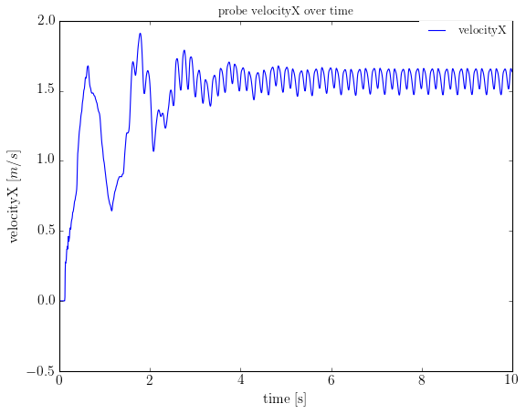
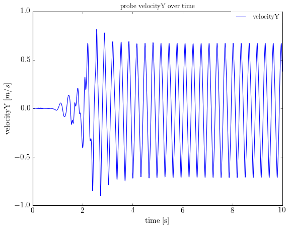
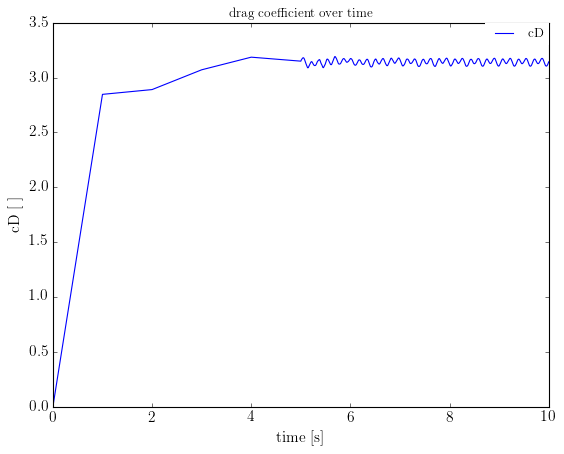
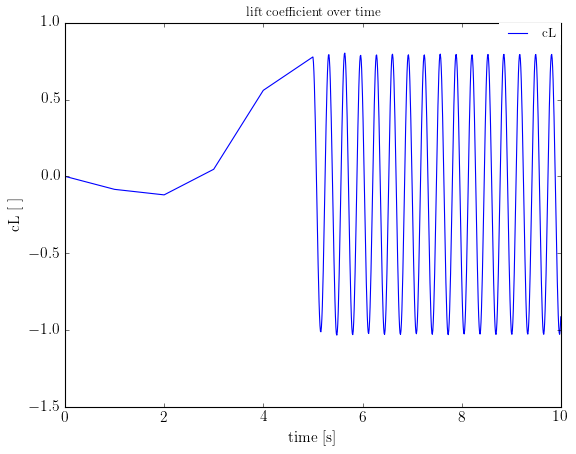
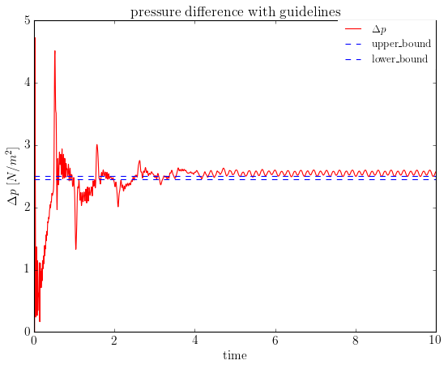
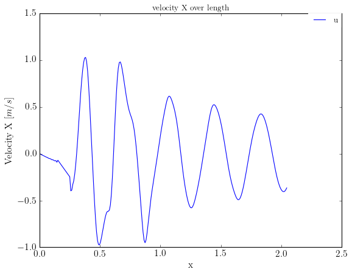
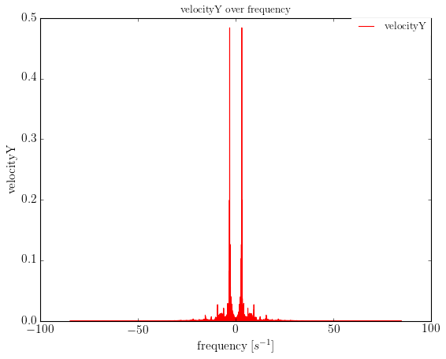

title: Unsteady Flow Around Cylinder 2D

Navigate: [&larr; Steady Flow Around Cylinder 2D](tutorial/steady.html) 
| [Test case Flow Around Cylinder 2D](tutorial/cylinder.html)

# Simulation of the unsteady flow

In this test case, the inflow conditions are not the same as for the steady 
flow. This is why we have to change parts in our created files that are already
existing from the last test case.

> Please make sure that you have gone through the Steady Flow Around Cylinder 
> test case. We need those files here.

## inflow conditions

* velocity
  \[
  U(0,y,t)=4U_{m}y\frac{(H-y)}{H^{2}}, V = 0
  \]
* Reynolds number
  \[
  Re = 100
  \]
* physical incoming velocity
  \[
  U_{m} = 1.5 \frac{m}{s}
  \]

The other conditions like mean velocity and geometry remain the same.

## What shall be computed?

* drag coefficient \(c_{D}\) and its maximum
* lift coefficient \(c_{L}\) and its maximum
* pressure difference \(\Delta P(t_{1},t_{2})\) at \([t_{0},t_{0}+\frac{1}{f}]\)
* pressure difference \(\Delta P(t)\) at \(t=t_{0}+\frac{1}{2f}\)
* Strouhal number  
  \[
  St=\frac{Df}{\bar{U}}=\frac{D}{T\bar{U}}
  \]

## common.lua

Now we go on with the common.lua file. Here, we just have to change the Reynolds
number: 

instead of
```
Re = 20
```
we write
```
Re = 100
```

## musubi.lua

In the musubi file we have to change the tracking table. The other ones remain 
the same.
So we have to think about which variables have to be tracked in order to compute
the above mentioned quantities.

* pressure difference
 
 In this case, the pressure difference is needed for a period of time at one 
 point in the channel.

### tracking table

What we need to track:

* velocity over time
* global flow 
* pressure over time
* lift and drag coefficient over time
* velocity over length

#### velocity over time

At first we have a look if our simulation reaches a steady state. Therefore, 
we need velocity over time.
We deactivate our old tracking table from the last test case and build a new one
with our first entry using ascii format for Gleaner.

```lua
tracking = {
{
  label = 'probe_velocity',
  folder = tracking_fol,
  variable = {'velocity_phy'},
   shape = {
             {kind = 'canoND', object = {origin = {length*0.5,0.2,zpos}}}},
   time_control = {min = 0, max = tmax, interval = 10*dt},
   output = {format = 'ascii'}
},
```

#### global flow

The next one will be the velocity and pressure over time regarding the global 
shape using harvester format for Harvester.

```lua
{ 
  label = 'global_shape',
  folder = tracking_fol,
  variable = {'pressure_phy',
              'velocity_phy',
              },
  shape = { kind = 'global' },
  time_control = {min =tmax ,max = tmax, interval = tmax},
  output = {format = 'vtk'}
},
```

#### pressure over time

In order to compute the pressure difference later on, we add pressure over time
at two points to tracking table:

```lua
{
  label = 'probe_pressure', -- pressure drop at two points over time: P(0.15,0.2,t) and P(0.25,0.2,t)
  folder = tracking_fol,
  variable = {'pressure_phy'}, 
  shape = {
          {kind = 'canoND', object = {origin ={0.15-dx,0.2,zpos} }},
          {kind = 'canoND', object = {origin ={0.25+dx,0.2,zpos} }}
          },
  time_control = {min = 0, max = tmax, interval = 10*dt},
  output = {format = 'ascii'}      -- over time
},
```

#### lift and drag coefficient over time

To go on with the lift and drag coefficients we add the coefficient over time to
the tracking table:

```lua
{
  label = 'cyl_coeff',
  folder = tracking_fol,
  variable = {'coeff'},
  shape = { kind = 'boundary', boundary = {'sphere'}},
  time_control = {min = tmax/2, max = tmax, interval = 1/100},
  output = {format = 'ascii'},
  reduction = {'sum'}
},
```

#### velocity over length

To have a look at the development of velocity vector over length we need to 
track velocity in ascii spatial format. It is tracked at the last time step.

```lua
{
  label = 'line', 
  folder = tracking_fol,
  variable = {'pressure_phy','velocity_phy'}, 
  shape = {kind = 'canoND', object = {origin = {0.0,height/2.,zpos},
                                     vec = { length, 0.0,0.0},
                                     segments = nLength+2}
                                         },
  time_control = {min = tmax, max = tmax, interval = tmax},
  output = {format = 'asciiSpatial'}      
}
```

What we need to visualize:

* global flow as animation

In order to visualize the global flow as an animation we have to create a file 
with pvd format.
Musubi generates the file for you and stores it in the output folder with all 
vtu files.

Now open the PVD file with Paraview.

## params_plot.py

What we need to plot:

* drag coefficient over time
* lift coefficient over time
* pressure difference over time
* frequency
* velocityX over time
* velocityX over length
* velocityY over time
* velocityY over length

This is the input file for Gleaner that will plot the tracked quantities of 
Musubi. It belongs to the post-processing part.

In the beginning we define some basic settings for Gleaner like if the plot 
shall be shown after running Gleaner, or if the output shall be written to 
files, or just the font type.

```lua
show_plot = True
font_family = 'serif'
font_type = 'Times New Roman'
font_size = 14
write_output = True
plot = []
```

After that, we can list each plot step by step.
So we do it step by step. The first one are velocity over time which are 
separated to x and y components.
We use a simple `xy` plot. We can see when a steady state is reached by the 
periodic signal.

> How we use Gleaner is shown in the Gleaner tuturial 

```lua
## velocityX over time 

plot.append(dict(kind = 'xy',data=['tracking/Re100/FlowAroundCyl_2D_probe_velocity_p00000.res'], col=[1,2], 
                       startplot = True, endplot = True, figname = 'velX_over_time',  ls = 'b', format = 'png',
                       convert = True, facs = [1.0, 1.0], title = 'probe velocityX over time',
                       xlabel = 'time [s]', ylabel = 'velocityX [${m}/{s}$]', label = 'velocityX' ))

## velocityY over time

plot.append(dict(kind = 'xy',data=['tracking/Re100/FlowAroundCyl_2D_probe_velocity_p00000.res'], col=[1,3], 
                       startplot = True, endplot = True, figname = 'velY_over_time',  ls = 'b', format = 'png',
                       convert = True, facs = [1.0, 1.0], title = 'probe velocityY over time',
                       xlabel = 'time [s]', ylabel = 'velocityY [${m}/{s}$]', label = 'velocityY' ))
```

Here we can see both plots:

 
 

The next thing is to plot the lift and drag coefficient over the time. Therefore
we can use again an `xy` plot.

```lua
## drag coefficient over time

plot.append(dict(kind = 'xy',data=['tracking/Re100/FlowAroundCyl_2D_cyl_coeff_p00000.res'], col=[1,2], 
                       startplot = True, endplot = True, figname = 'cD_over_time',  ls = 'b', format = 'png',
                       convert = True, facs = [1.0, 1.0], title = 'drag coefficient over time',
                       xlabel = 'time [s]', ylabel = 'cD [ ]', label = 'cD' ))

## lift coefficient over time

plot.append(dict(kind = 'xy',data=['tracking/Re100/FlowAroundCyl_2D_cyl_coeff_p00000.res'], col=[1,3], 
                       startplot = True, endplot = True, figname = 'cL_over_time',  ls = 'b', format = 'png',
                       convert = True, facs = [1.0, 1.0], title = 'lift coefficient over time',
                       xlabel = 'time [s]', ylabel = 'cL [ ]', label = 'cL' ))
```

Here we can see the results:




We go on with the pressure difference over time. It is computed by using two 
points which were defined in the tracking table. It has a special `kind = deltaP`.

```lua
## pressure difference over time
  
plot.append(dict(kind='deltaP', data=['tracking/Re100/FlowAroundCyl_2D_probe_pressure_p00000.res',
                      'tracking/Re100/FlowAroundCyl_2D_probe_pressure_p00000.res'], col=[1,2,3], 
                      startplot = True, endplot = False, label = '$\Delta p$', ls = 'r'))
plot.append(dict(kind='axhline', endplot = False, val = 2.50, label = 'upper\_bound', ls = 'b--'))
plot.append(dict(kind='axhline', endplot = True, val = 2.46, label = 'lower\_bound', ls = 'b--',
                      xlabel='time', ylabel='$\Delta p$ [${N}/{m^{2}}$]', figname = 'deltaP_over_time',format='png',
                      convert = True, facs=[1.0,1.e-3], title = 'pressure difference with guidelines', titlesize = 16))
```

We get two results. One image with the plot and one text file under `filedata/`
containing the values.

```lua
#filaname 	 average 	 min 	 max 	 last 
tracking/Re100/FlowAroundCyl_2D_probe_pressure_p00000.res	2.4689231451	0.0	4.72413262507	2.57346840196
```



Then, we plot the x and y components of velocity over the length. Therefore, 
we use once again a simple `kind = xy` plot.

```lua
## velocityY over length

plot.append(dict(kind='xy', data=['tracking/Re100/FlowAroundCyl_2D_line_p00000_t10.000E+00.res'],
            col=[1,6], xlabel='x', ylabel='Velocity Y [${m}/{s}$]', figname = 'velY_over_length', format = 'png',
            startplot = True, endplot = True, ls = '-b', title = 'velocity Y over length',
            label = 'v'))

## velocityX over length

plot.append(dict(kind='xy', data=['tracking/Re100/FlowAroundCyl_2D_line_p00000_t10.000E+00.res'],
            col=[1,6], xlabel='x', ylabel='Velocity X [${m}/{s}$]', figname = 'velX_over_length', format = 'png',
            startplot = True, endplot = True, ls = '-b', title = 'velocity X over length',
            label = 'u'))
```

Here are the resulting plots:

 
 

Last but not least we plot the frequency which is needed to compute the Strouhal
number. We use a special `kind = FFT` which means 'Fast Fourier Transform' to do 
so. 

> It is important to refer to velocityY instead of the pressure difference. If 
> we use pressure difference we will get the right solution multiplied by 2.

```lua
## frequency

plot.append(dict(kind = 'FFT', data=['tracking/Re100/FlowAroundCyl_2D_probe_velocity_p00000.res'],
                    col=[1,3],startplot = True, endplot = True, xlabel = 'frequency [$s^{-1}$]', ylabel = 'velocityY', ls ='r', 
                    convert = True, facs = [1.0, 1.0],figname = 'frequency',format ='png', label = 'velocityY', title = 'velocityY over frequency'))
```

Again we get two results, a textfile and a plot. The plot shows the frequency on 
the x-axis and velocityY on the y-axis.
In the text file, we get the exact value for the frequency which we use to 
compute the Strouhal number.



Here is the resulting text file:
```lua
#filaname 	 Frequency 
# tracking/Re100/FlowAroundCyl_2D_probe_velocity_p00000.res	3.0989387494
```

What we have to compute after that:

* Strouhal number with results of frequency
* maximum values for lift and drag coefficient with results from tracking folder

### computing Strouhal number and lift and drag coefficients

The frequency is used then for computing the Strouhal number in Python for 
example. It is defined as

```lua
St = Dia*f/u_mean_phy
```
So we get our result for Strouhal number like:
```lua
>>> 3.0989387494*0.1
0.30989387494
```

The maximum of lift and drag coefficient can be computed by a simple python 
script. We call it `get_coeff_max.py` for example.

```lua 
import numpy as np

data=np.loadtxt('tracking/Re100/FlowAroundCyl_2D_cyl_coeff_p00000.res', skiprows = 2, usecols = [0,1])
cD_max = np.nanmax(data[:,1])

data2 = np.loadtxt('tracking/Re100/FlowAroundCyl_2D_cyl_coeff_p00000.res', skiprows = 1, usecols = [0,2])
cL_max = np.nanmax(data2[:,1])
time = data2[np.argmax(data2[:,1]),0]

print("t_0 = ",time)

print("cD_max = ",cD_max)
print("cL_max = ",cL_max)
```

The results are:

```lua
t_0 =  5.64226175439
cD_max =  3.19177160837
cL_max =  0.802261936509
```

Here ends the tutorial for the Flow Around Cylinder test case.

Navigate: [&larr; Steady Flow Around Cylinder 2D](steady.html) 
| [Test case Flow Around Cylinder 2D](index.html)
