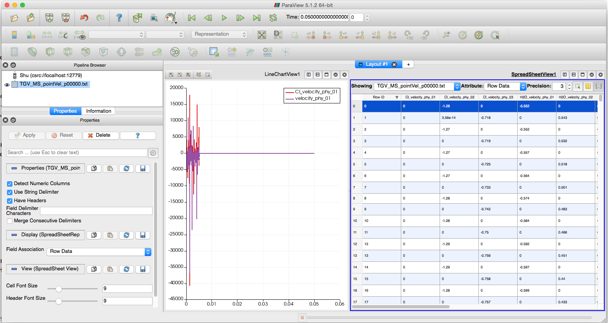

title: Multispecies test case: Taylor Green Vortex

Navigate: [&larr; Tutorial Overview](../index.html)

@note You are free to change content of this page. It is a first version that lists
most content of test case files and corresponding Musubi modules.
@endnote

# common.lua

Formulae from common.lua:

$$dx=\frac{L}{nL}$$

$$nL_{bnd}=nL+2$$

$$lvl=ceil\left ( \frac{log(nL_{bnd})}{log(2)} \right )$$

$$L_{bnd}=2^{lvl}\cdot dx$$

Physical tmax = 0.02
Lattice tmax = 800
$$dt=\frac{t_{max_p}}{t_{max_l}}$$

Molecular weights of species:
$$m_{H_{2}O}=18.01528 \cdot 10^{-3}\frac{kg}{mol}$$
$$m_{Na}=22.98977 \cdot 10^{-3}\frac{kg}{mol}$$
$$m_{Cl}=35.4527 \cdot 10^{-3}\frac{kg}{mol}$$

## Initial conditions for Taylor Green Vortex test case:

Kinematic pressure:
$$p_{kin} = \frac{\rho_{0} }{4}  \left( \cos \left ( \frac{4\pi x}{L} \right ) + \cos \left ( \frac{4\pi y}{L} \right ) \right)$$
Velocity in x-direction:
$$u_{x} = \sin \left ( \frac{2\pi x}{L} \right ) \cos \left ( \frac{2\pi y}{L} \right )$$
Velocity in y-direction:
$$u_{y} = -\cos \left ( \frac{2\pi x}{L} \right ) \sin \left ( \frac{2\pi y}{L} \right )$$
Molefraction Na 
$$N_{Na} = \frac{1}{3}$$
Molefraction H2O 
$$N_{H_{2}O} = \frac{1}{3}$$
Molefraction Cl 
$$N_{Cl} = 1 - N_{H_{2}O} - N_{Na}$$

The content of the file is shown in the following embedded code:

```lua
-- all units are in physical units
-- length (m)
-- Parameters for SEEDER
refinement_factor = 2
length            = 2*math.pi
nLength           = 60
nWidth            = 1
dx                = length/nLength
nLength_bnd       = nLength + 2
level             = math.ceil(math.log(nLength_bnd)/math.log(2))
length_bnd        = (2^level)*dx

-- Time step settings for MUSUBI
tmax_p = 0.05
tmax   = 1000
-- time step size 
dt     = tmax_p/tmax

-- molecular weights(kg/mol)
mH2O  = 18.01528e-3 -- H20
mNa   = 22.98977e-3 -- Na
mCl   = 35.4527e-3  -- Cl
m_min = math.min(mH2O,mNa,mCl)

-- fake diffusivities
diff_diag   = 1.0e-2
diff_H2O_Na = 1.31570699e-3
diff_H2O_Cl = 2.097388e-3
diff_Na_Cl  = 2.95407e-5

-- density
rho0      = 1.0 --1000.0 -- kg/m^3
moleDens0 = 1.0

-- shear viscosity
nu_p = 1e-6 --m^2/s
--------------------------------------------------------
-- Initial condition for taylor green vortex testcase
--------------------------------------------------------
-- constant density for all species
-- kinematic pressure
function TGV_kinematicPressure(x,y,z)
  return (rho0/4.0) * (math.cos(4*math.pi*x/length) + math.cos(4*math.pi*y/length))
end

-- all species are initialized with mixture velocity
-- mixture velocityX
function TGV_velocityX(x,y,z)
  return math.sin(2*math.pi*x/length)*math.cos(2*math.pi*y/length)
end

-- mixture velocityY
function TGV_velocityY(x,y,z)
  return -math.cos(2*math.pi*x/length)*math.sin(2*math.pi*y/length)
end


-- molefraction initial conditions
function molefrac_H2O(x,y,z)
  --return 0.1*math.sin(2*math.pi*x/length)*math.cos(2*math.pi*y/length) + 0.3
  return 1.0/3.0
end

function molefrac_Na(x,y,z)
  --return 0.1*math.cos(2*math.pi*x/length)*math.sin(2*math.pi*y/length) + 0.3
  return 1.0/3.0
end

function molefrac_Cl(x,y,z)
  r1 = molefrac_H2O(x,y,z)
  r2 = molefrac_Na(x,y,z)
  return 1.0 - r1 - r2
end

-- velocity initial conditions for each species

-- Species 1 H2O
p1 = length/8 -- [0, L] 
function velX_H2O(x,y,z)
  return math.sin(2*math.pi*(x+p1)/length)*math.cos(2*math.pi*(y+p1)/length)
end
function velY_H2O(x,y,z)
  return -math.cos(2*math.pi*(x+p1)/length)*math.sin(2*math.pi*(y+p1)/length)
end

-- Species 2 Na
p2 = 0 -- 0 or L
function velX_Na(x,y,z)
  return math.sin(2*math.pi*(x+p2)/length)*math.cos(2*math.pi*(y+p2)/length)
end
function velY_Na(x,y,z)
  return -math.cos(2*math.pi*(x+p2)/length)*math.sin(2*math.pi*(y+p2)/length)
end

-- Species 3 Cl
function velX_Cl(x,y,z)
  chi1 = molefrac_H2O(x,y,z)
  chi2 = molefrac_Na(x,y,z)
  chi3 = 1.0 - chi1 - chi2
  r1 = chi1*moleDens0*mH2O
  r2 = chi2*moleDens0*mNa
  r3 = chi3*moleDens0*mCl
  rtotal = r1+r2+r3
  vX = TGV_velocityX(x,y,z)
  vX1 = velX_H2O(x,y,z)
  vX2 = velX_Na(x,y,z)
  return (rtotal/r3)*vX - ( (r1/r3)*vX1 + (r2/r3)*vX2 )
end

function velY_Cl(x,y,z)
  chi1 = molefrac_H2O(x,y,z)
  chi2 = molefrac_Na(x,y,z)
  chi3 = 1.0 - chi1 - chi2
  r1 = chi1*moleDens0*mH2O
  r2 = chi2*moleDens0*mNa
  r3 = chi3*moleDens0*mCl
  rtotal = r1+r2+r3
  vY = TGV_velocityY(x,y,z)
  vY1 = velY_H2O(x,y,z)
  vY2 = velY_Na(x,y,z)
  return (rtotal/r3)*vY - ( (r1/r3)*vY1 + (r2/r3)*vY2 )
end
```

# seeder.lua

##Location of seed:

$$\vec{r}_{seed}=\begin{bmatrix}L/2\\L/2\\dx\end{bmatrix}$$

## Origin of the bounding cube:

$$\vec{r}_{cube}=\begin{bmatrix}-dx\\-dx\\-dx\end{bmatrix}$$

In seeder.lua we define the geometry for the test case. Here we use periodic planes.
The Seeder documentation contains tutorials for periodic planes.

In the following we see the location of the planes.

## First set of periodic planes:

### Origin of first periodic plane:

$$\vec{r}_{p1}=\begin{bmatrix}-dx\\-dx\\(n_W+1)dx+\frac{dx}{2}\end{bmatrix}$$

### Vector of first periodic plane:

$$\vec{p}_{1}=\begin{bmatrix}L+2dx & 0\\0 & L+2dx\\0 & 0\end{bmatrix}$$

### Origin of second periodic plane:

$$\vec{r}_{p2}=\begin{bmatrix}-dx\\-dx\\-dx/2\end{bmatrix}$$

### Vector of second periodic plane:

$$\vec{p}_{2}=\begin{bmatrix}0 & L+2dx\\L+2dx & 0\\0 & 0\end{bmatrix}$$

## Second set of periodic planes:

### Origin of first periodic plane:

$$\vec{r}_{p1}=\begin{bmatrix}-dx\\-dx/2\\-dx\end{bmatrix}$$

### Vector of first periodic plane:

$$\vec{p}_{1}=\begin{bmatrix}L+2dx & 0\\0 & 0\\0 & L+2dx\end{bmatrix}$$

### Origin of second periodic plane:

$$\vec{r}_{p2}=\begin{bmatrix}-dx\\L+dx/2\\-dx\end{bmatrix}$$

### Vector of second periodic plane:

$$\vec{p}_{2}=\begin{bmatrix}0 & 0\\0 & L+2dx\\L+2dx & 0\end{bmatrix}$$

## Third set of periodic planes:

### Origin of first periodic plane:

$$\vec{r}_{p1}=\begin{bmatrix}-dx/2\\-dx\\-dx\end{bmatrix}$$

### Vector of first periodic plane:

$$\vec{p}_{1}=\begin{bmatrix}0 & 0\\0 & L+2dx\\L+2dx & 0\end{bmatrix}$$

### Origin of second periodic plane:

$$\vec{r}_{p2}=\begin{bmatrix}L+dx/2\\-dx\\-dx\end{bmatrix}$$

### Vector of second periodic plane:

$$\vec{p}_{2}=\begin{bmatrix}0 & 0\\L+2dx & 0\\0 & L+2dx\end{bmatrix}$$

Periodic planes are part of the `spatial_object` table. The corresponding
keyword is `periodic` as a kind both for `attribute` and `geometry` table.
Each plane is defined by origin and two vectors and two planes are needed 
for the periodic spatial object. Here you can see an example on how to define
such an object.

```lua
table.insert(spatial_object,
{
  attribute = {
    kind = 'periodic',
    level = ,-- level number or variable
  },
  geometry = {
    {
      kind = 'periodic',
      object = {
        plane1 = {
          origin = {...,...,...},
          vec = {{...,...,...},
                 {...,...,...}}
        },
        plane2 = {
          origin = {...,...,...},
          vec = {{...,...,...},
                 {...,...,...}}
        }         
      }
    },
    ...
  },
  ...
})
```

The file content is provided in the following embedded code:

```lua
-- load lua variables from simParam.lua
require "common"

-- Location where to save mesh files
folder = 'mesh/'

-- debug mode
-- debug = {debugMode = true, debugFiles = false, debugMesh='debug/' }

-- minimum level
minlevel = level
-- output file for computation time info
timing_file = 'sdr_timing.res'

-- bounding cube: two entries: origin and length in this
-- order, if no keys are used
bounding_cube = {origin = {-dx, -dx, -dx},
               length = length_bnd
              }

-- Seed
spatial_object = {
  {
    attribute = {
      kind = 'seed',
    },
    geometry = {
      kind = 'canoND',
      object = {
        origin = { length/2.0, length/2.0, dx/2. },
        }
    }
  },
  {
    attribute = {
      kind = 'periodic',
      level = level
    },
    geometry = {
      -- first periodic set
      {
        kind = 'periodic',
        object = {
          plane1 = {
            origin = {-dx,-dx,nWidth*dx+dx/2},
            vec = {{length+2*dx,0.0,0.0},
                 {0.0,length+2*dx,0.0}}
          },
          plane2 = {
            origin = {-dx,-dx,-dx/2},
            vec = {{0.0,length+2*dx,0.0},
                   {length+2*dx,0.0,0.0}}
          }         
        }
      },
      -- second periodic set
      {
        kind = 'periodic',
        object = {
          plane1 = {
            origin = {-dx,-dx/2.,-dx},
            vec = {{length+2*dx,0.0,0.0},
                 {0.0,0.0,length+2*dx}}
          },
          plane2 = {
            origin = {-dx,length+dx/2.,-dx},
            vec = {{0.0,0.0,length+2*dx},
                   {length+2*dx,0.0,0.0}}
          }         
        }
      },
      -- third periodic set
      {
        kind = 'periodic',
        object = {
          plane1 = {
            origin = {-dx/2.,-dx,-dx},
            vec = {{0.0,0.0,length+2*dx},
                 {0.0,length+2*dx,0.0}}
          },
          plane2 = {
            origin = {length+dx/2.,-dx,-dx},
            vec = {{0.0,length+2*dx,0.0},
                   {0.0,0.0,length+2*dx}}
          }         
        }
      }
    }
  },
}
```

# musubi.lua

In Musubi we need to check the following:

## General settings

```lua
-- load lua variables from simParam.lua
require "common"

-- simulation parameters
io_buffer_size   = 1
printRuntimeInfo = true
simulation_name  = 'TGV_MS'
```

## communication pattern

  * `isend_irecv`
  * `isend_irecv_overlap`
  * `...`

Usage like:

```lua
commpattern = 'isend_irecv'
```

## mesh location

Usage like:

```lua
mesh = 'mesh/' -- mesh folder
```

## interpolation method

  * average
  * linear
  * quadratic

Usage like:

```lua
interpolation_method = 'average'
```

## scaling
    
  * diffusive
  * ...

Usage like:

```lua
scaling = 'diffusive'
```

## time step setting
    
  * maximum time
  * increment

Usage like:

```lua
sim_control = {
  time_control = {
    max = 0.05, interval = 0.005 
  }
}  
```

## physics
    
  * density
  * mole density
  * time increment for lattice value conversion

Usage like:

```lua
physics = {
  rho0 = 1.0,
  dt = 0.05/1000,
  mole_dens0 = 1.0
}
```

## identify the model
    
  * `kind = 'multi-species_gas'`
  * `kind = 'multi-species_liquid'`
  * relaxation kind
    * `bgk`
    * `mrt`
    * special kinds: `bgk_withthermodynfac` and `mrt_withthermodynfac`
  * stencil layout
    * `d3q19`
    * `d2q9`

Usage like:

```lua
identify = {
    kind = 'multi-species_liquid', 
    relaxation = 'bgk', 
    layout = 'd3q19'
}
```

## mixture

In the mixture table one defines initial conditions, mixture density,
equilibrium theta, kinematic viscosity relaxation parameter and
diffusivity relaxation parameter.

Density keyword is `rho0` and its default is `1.0_rk`. From density 
the bulk modulus K is computed like:
$$K=c_{s}^{2}\rho$$ 
with 
$$c_{s}=\frac{1}{\sqrt{3}}$$

Lattice mixture number density is called `moleDens0` and its default is `1.0_rk`.

Equilibrium theta is called `theta_eq`. It is used to choose between mixture 
velocity and equilibrium species velocity in the quatratic term of the 
equilibrium function. 
$$\left\{\begin{matrix}\theta_{eq} = 0 &&\rightarrow &&\text{mixture velocity}\\\theta_{eq} = 1&&\rightarrow &&\text{equilibrium species velocity}\end{matrix}\right.$$

  Mass averaged mixture velocity in quadratic part of equilibrium function.
  
One can provide omega ramping and spatial viscosity `visc_spatial`.

Diffusivity relaxation parameter is named `omega_diff` and its 
default is `2.0_rk`.
The equation \(\omega_{diff}=B c_{s}^{2}\) can be converted so that one can 
provide either `paramB` or `omega_diff`. Otherwise `omega_diff` will be 
equal to two and `paramB` is computed by `omega_diff` and `cs2`. 
Use `cs2 = p/rho` for multi-species gas or `cs2 = K/rho` for 
multi-species liquid.

One provides either kinematic viscosity relaxation parameter `omega_kine`
or `kine_shear_viscosity`. If both is not defined these parameters are 
computed by speed of sound and diffusivity relaxation parameter.
\(\nu=\frac{c_{s}^{2}}{\omega_{diff}}\)

If bulk viscosity is not provided, it is computed from shear viscosity.
  \(\nu_{B}=\frac{2}{3}\nu\)

One can provide an electric field as a three dimensional vector.
`electricField = {...,...,...}` The default values are `{0.0,0.0,0.0}`.
The gravity field can also be added. It is defined like 
`gravityField = {0.0, 0.0, 0.0}`. These are the default values.

Initial temperature is defined in Kelvin and the default value is `temp=273._rk`.
Atmospheric pressure can be defined like `atm_press=1.01325e5_rk`.

Usage like:

```lua
-- lua function for kinematic pressure
function TGV_kinematicPressure(x,y,z)
  return (rho0/4.0) * (math.cos(4*math.pi*x/length) + math.cos(4*math.pi*y/length))
end

mixture = { 
  rho0 = 1.0, 
  moleDens0 = 1.0, 
  omega_diff = 2.0,
  omega_kine = 2.0,
  theta_eq = 1,
  initial_condition = { 
    pressure = TGV_kinematicPressure -- reference to lua function
  }
}
```

## fluid fields
    
  * mole weight
  * coefficients for diffusivity
  * initial conditions
  
  A field is defined in MUSUBI with `label`,`species` and `initial_condition`.
  Inside the `species` table one defines the molecular weight of species with
  keyword `molweight`. 
  For ions one can provide the charge number with `charge_nr`. Zero is used
  as default value. Then provide the coefficients for diffusivity (`diff_coeff`)
  or resistivity (`resi_coeff`)
  @note `diff_coeff=1/resi_coeff`
  @endnote
  Bulk viscosity omega is computed by:
  \(\omega_{B}=\frac{2-\phi_\sigma}{3}\) where \(\phi_\sigma\) is the 
  molecular weight ratio. It is computed like:
  \( \phi_\sigma = \frac{min_\varsigma(m_\varsigma)}{m_\sigma} \)
  The formula is taken from:
  "Lattice Boltzmann scheme for mixture modeling: Analysis of the continuum
  diffusion regimes recovering Maxwell-Stefan model and incompressible 
  Navier-Stokes equations. Pietro Asinari(2009)"
  In [[mus_field_module:mus_set_ic_states]] the needed initial conditions are listed.
  
  For `multi-species_gas`:
  
  * initial conditions
    * pressure
    * velocityX
    * velocityY
    * velocityZ
  
  For `multi-species_liquid`:
  
  * initial conditions
    * mole_fraction
    * velocityX
    * velocityY
    * velocityZ

Usage like:

```lua
-- lua functions provided in common.lua
field = {
  {
    label = 'H2O',
    -- species properties
    species = { 
      molweight = mH2O, 
      diff_coeff = { 
        diff_diag, 
        diff_H2O_Na, 
        diff_H2O_Cl 
      }
    },
    -- Initial condition
    initial_condition = { 
       mole_fraction = molefrac_H2O,
       velocityX = velX_H2O,
       velocityY = velY_H2O,
       velocityZ = 0.0
    }
  },
  {
    label = 'Na',
    species = { 
      molweight = mNa, 
      diff_coeff = { 
        diff_H2O_Na, 
        diff_diag, 
        diff_Na_Cl 
      }
    },
    initial_condition = {
      mole_fraction = molefrac_Na,
      velocityX = velX_Na,
      velocityY = velY_Na,
      velocityZ = 0.0
    }
  },
  {
    label = 'Cl',
    species = { 
      molweight = mCl, 
      diff_coeff = { 
        diff_H2O_Cl, 
        diff_Na_Cl, 
        diff_diag 
      }
    },
    initial_condition = {
      mole_fraction = molefrac_Cl,
      velocityX = velX_Cl,
      velocityY = velY_Cl,
      velocityZ = 0.0
    }
  }
}
```

## tracking

Usage like:

```lua
tracking = {
  {
    label = 'pointVel', 
    variable = {'H2O_velocity_phy','Na_velocity_phy','Cl_velocity_phy','velocity_phy'},
    folder = './',
    shape = {
      kind = 'canoND', 
      object= {
        origin={length/4,length/2.,dx/2.0}
      }
    },
    output={format = 'ascii'},
    time_control = {min = 0, max = tmax_p, interval = tmax_p/tmax}, 
  }
}
```

## restart

Usage like:

```lua
restart = {
  ead = 'restart/', -- deactivated
  write = 'restart/',
  time_control = {min = 0, max = tmax_p, interval = tmax_p}
}
```

The resulting file can be visualised with Paraview for example if no written script for Gnuplot or Gleaner is available.
To do this rename the .res file to a .txt file. Then open Paraview and set Layout to LineChartView. 
After that import the renamed file and choose space as data delimiter. 



Navigate: [&larr; Tutorial Overview](../index.html)
