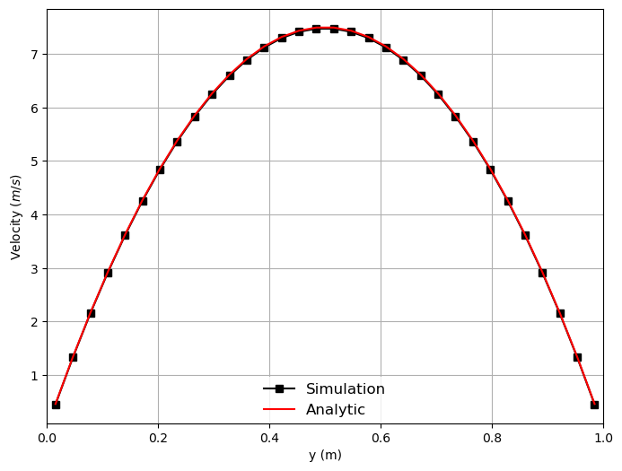
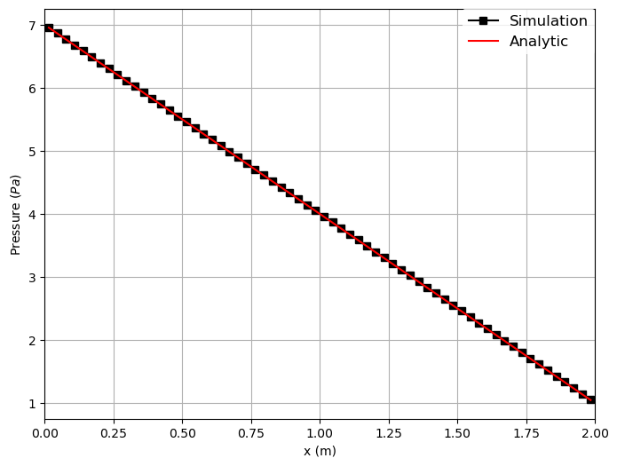

title: Poisueille flow in a channel 2D

Navigate: [&larr; Test case channel 2D](../../index.html)

# Poisueille flow in a channel 2D using BGK collision scheme # {#eg_C2D_Simple_BGK}

In this example, we will investigate the Poiseuille flow in a plain 2D channel
using the bgk collision scheme.

A detailed description of test case can be found in the parent directory
[Description of test case channel 2D](../index.html).

## Generating mesh ##
### Define geometry information ###
### Define spatial objects ###

## Running simulation ##
### Define flow parametes ###
### Define collision parameter ###
### Define boundary condition ###
## Post-processing ##

Here are the results from the simulation.

Velocity along the height of the channel:

Pressure across the length of the channel:

Wall shear stress along the height of the channel:

To create these plots, run <tt>python plot_track.py<tt> to create the plots.
Before running the plot script, open 'plot_track.py' and update path to
Gleaner script in 'glrPath'.
Download Gleaner script using
<tt>hg clone https://geb.sts.nt.uni-siegen.de/hg/gleaner</tt>
