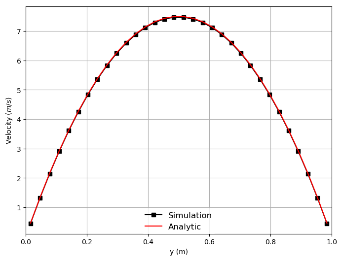
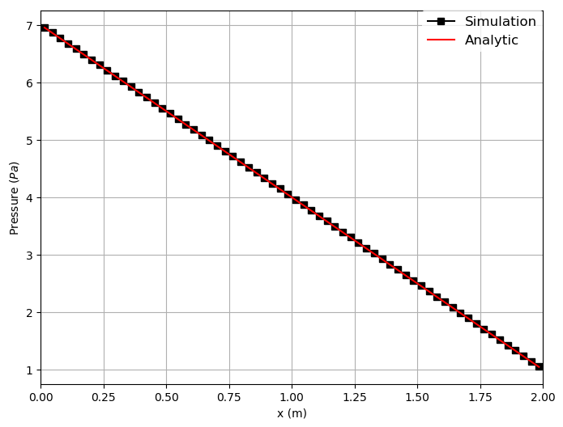

title: Poisueille flow in a channel 2D

Navigate: [&larr; Test case channel 2D](../../index.html)

# Poisueille flow in a channel 2D using hrrBGK collision scheme # {#eg_C2D_Simple_hrrBGK}

In this example, we will investigate the Poiseuille flow in a plain 2D channel
using the hybrid recursive regularized bgk (hrrBGK) collision scheme with a
fourth order regularization.

This collision scheme is called as below in the identify table.
relaxation = 'hrr_bgk'

The fluid table in musubi.lua should include the following
--! [Fluid]
fluid = {
  kinematic_viscosity = nu_phy,
  hrr_sigma = 0.99 -- default = 0.98
}
--! [Fluid]

The sigma has a default value of 0.98 which can be overwritten from input. This
represents a blending coefficient, therefore must be greater equal than 0.0
and lower equal than 1.0. A value of 0.00 reverts the HRR to the PRR scheme.
A value of 1.0 reverts the HRR into the RR scheme. Any value in between
is a blended scheme. For non dissipative runs, try to stay closer to 0.98.
The RR scheme dissipates less than the PRR scheme.

A detailed description of test case can be found in the parent directory
[Description of test case channel 2D](../index.html).

## Generating mesh ##
### Define geometry information ###
### Define spatial objects ###

## Running simulation ##
### Define flow parametes ###
### Define collision parameter ###
### Define boundary condition ###
## Post-processing ##

Here are the results from the simulation. To create them, double the number of
elements in height (nHeight=32) in seeder.lua.

Velocity along the height of the channel:

Pressure across the length of the channel:

Wall shear stress along the height of the channel:

To create these plots, run <tt>python plot_track.py<tt> to create the plots.
Before running the plot script, open 'plot_track.py' and update path to
Gleaner script in 'glrPath'.
Download Gleaner script using
<tt>hg clone https://geb.sts.nt.uni-siegen.de/hg/gleaner</tt>
