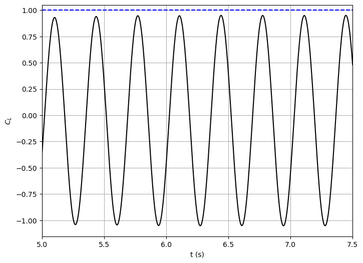
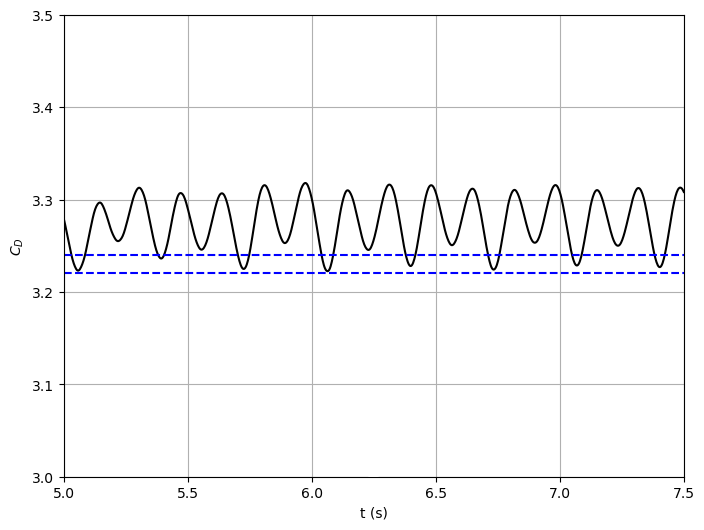
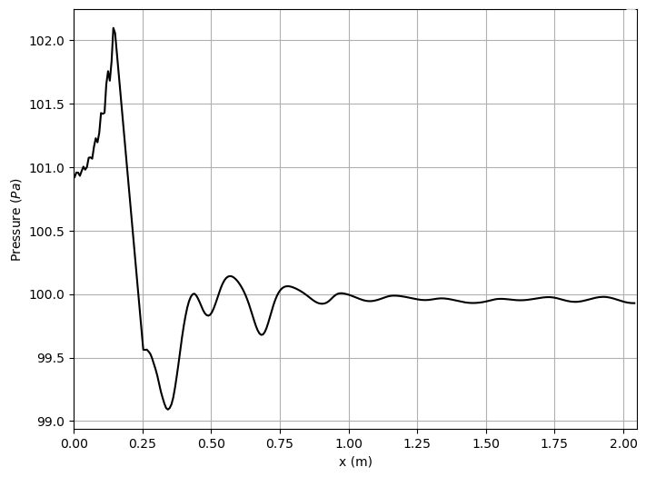
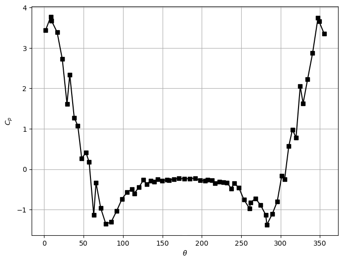
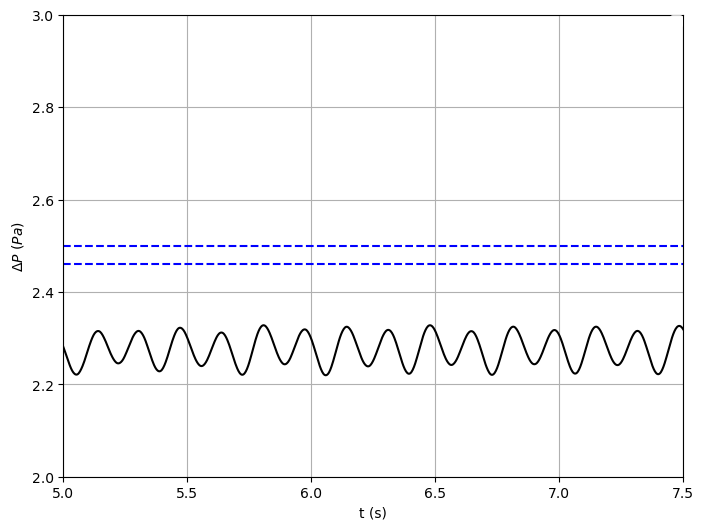
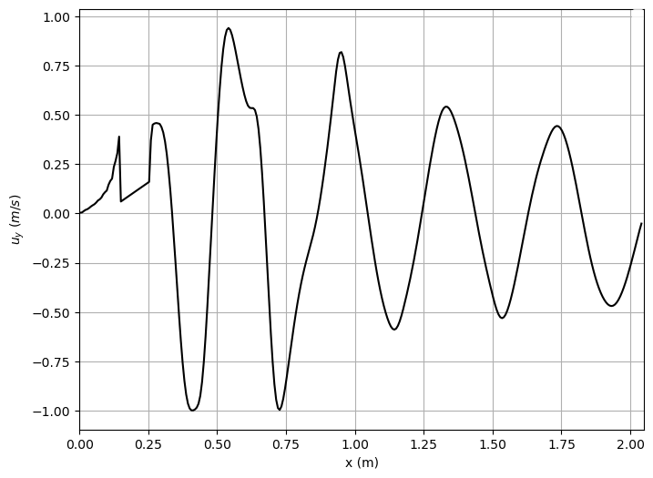
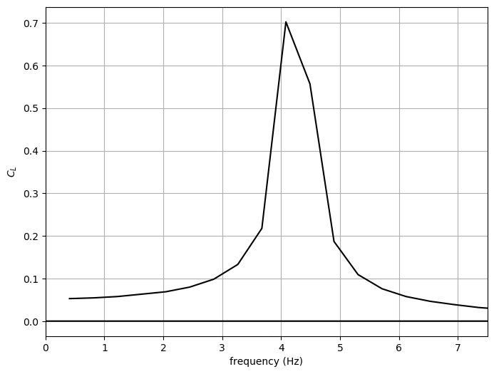

title: Flow around the cylinder 2D single level
@warning WORK IN PROGRESS @endwarning

Navigate: [&larr; Test Case Channel 2D](../index.html)
| [Test Case Channel 2D Cylinder Multi-Level &rarr;](../C2D_Cylinder_MultiLevel/index.html)

# Flow around the cylinder in a channel 2D # {#eg_C2D_Cyl_SL}

This example looks at the flow though a 2D channel with a cylinder placed into
it.

## Problem description ##

The Poiseuille flow is the fully developed laminar flow between two parallel
plates induced by a constant pressure drop in a channel of length L.
We place a cylinder into that channel as a disturbance and look at the flow
around this cylinder.
In general, the flow can be induced by any of the following way:

* Defining pressure at inlet and outlet of the channel.
* Defining velocity at inlet and pressure at outlet of the channel.
* Using pressure gradient i.e. pressure drop/length as a external force.

Here, the flow is induced by pressure boundary conditions at inlet (west)
and outlet (east) boundaries.

The pressure drop along the channel per unit length is
\begin{equation}
  \frac{\nabla p}{L} = \frac{p_{inlet} - p_{outlet}}{L}
  = \frac{8 \mathbf{U}_m \rho\nu}{H^2}
\end{equation}
where,

* \( \mathbf{U}_m \) - the maximum fluid velocity at the channel center axis,
* \( \rho=1.0 \) - the fluid density and
* \( \nu=10^{-3} m^2/s \) - kinematic viscosity.

@Note
In this testcase we compute the viscosity according to the Reynolds number
and the speed of sound according to the Mach number.
@endnote

The Reynolds number is defined as
\begin{equation}
  Re=\frac{\mathbf{\bar U} H}{\nu}
\end{equation}
where, \( \bar{U} \) - the mean velocity.
For the parabolic velocity profile, the mean velocity can be computed with
\( \mathbf{\bar U} = 2 \mathbf{U}_m /3 \).

## Post-processing ##

Tracking relevant quantities gives us the following visualizations:

Lift coefficient of the cylinder over time:

Drag coefficient of the cylinder over time:

Pressure along the length of the channel:

Pressure coefficient over the cylinder surface:

Pressure difference between stagnation in front of cylinder
and back of the cylinder over time:

The X-velocity component along the length of the channel:

The Y-velocity component along the length of the channel:

A Fourier transform of the flow field:

To create these plots, run <tt>python plot_track.py<tt> to create the plots.
Before running the plot script, open 'plot_track.py' and update path to
Gleaner script in 'glrPath'.
Download Gleaner script using
<tt>hg clone https://geb.inf.tu-dresden.de/hg/gleaner</tt>
