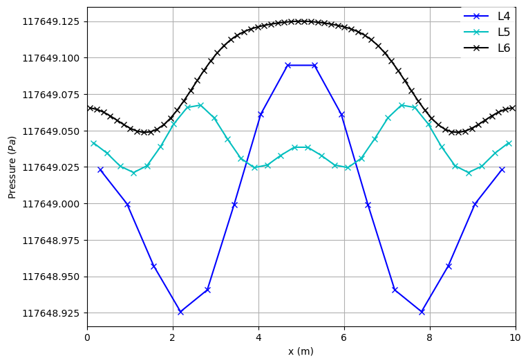

title: Gaussian Pulse in Pressure in a Cube
@warning WORK IN PROGRESS @endwarning
Progress of this test case is tracked in the following ticket:
Action #2206: Test case - Benchmark: Gaussian pulse
# Gaussian Pulse in Pressure in a Cube # {#eg_GPP}

In this example, we will simulate a Gaussian pulse in pressure in a simple
pre-defined cube with periodic boundaries and user-defined initial condition.
The gaussian pulse can be also used via a lua function, c. f.
* [lua-function of gaussian pulse](../../../fluid/benchmark/gaussianPulse/index.md)
For this simple geometry, we even do not need *Seeder*.

The objectives of this example is to introduce how to:
* Use a pre-defined geometry instead of creating a mesh with Seeder.
* Simulate the Gaussian pulse in the cube using Musubi.
* Create 2D plots using the Gleaner tool. Gleaner is a Python tool that extracts
  data from Musubi ASCII output and uses the plotting library Matplotlib in
  Python to create a plot.
* Validate the numerical results by comparing them against the analytic
  solution. The latter one is calculated using NumPy, a mathematic extension for
  Python.
* Compare the simulation results (L4) to previously generated data obtained with
  higher resolution (reference folder, L5 & L6) to experience the influence of
  the resolution.

## ToDo ##
This file has to be filled with content like:
* Problem description
* Formulas
* Results
* Comparison for different resolutions
* How to run the simulation

Here are the results from the simulation.

Pressure across the length of the channel for different resolutions at the
beginning (initial condition):

The higher the level -- and with that the resolution -- the better the solution
compared to the analytical one.

Pressure across the length of the channel for different resolutions at the end:

It can be seen that the resolution has a great impact on the results.

To create these plots, run <tt>python plot_track.py<tt> to create the plots.
Before running the plot script, open 'plot_track.py' and update path to
Gleaner script in 'glrPath'.
Download Gleaner script using
<tt>hg clone https://geb.sts.nt.uni-siegen.de/hg/gleaner</tt>
