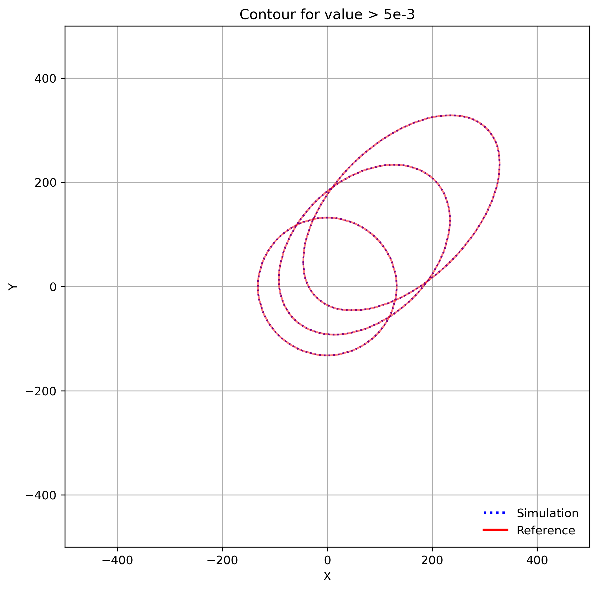

title: Advection-anisotropic-diffusion of a Gaussian Hill with TRT-EmodelCorr
@warning WORK IN PROGRESS @endwarning

# Advection-anisotropic-diffusion of a Gaussian Hill with TRT-EmodelCorr # {#eg_GPP}

In this example, the time evolution of a Gaussian hill has anisotropic diffusivity 
  in an infinite space with periodic boundaries.

The analytical solution in \(d\) dimensions is given by the anisotropic multivariate Gaussian distribution

  $$C(\mathbf{x}, t) = 
  \frac{C_0}{(2\pi)^{d/2}\|\sigma\|^{1/2}}
  \exp\!\left[
  -\tfrac{1}{2} \sigma^{'}_{\alpha\beta} 
  \frac{(x_\alpha - \bar{x}_\alpha)(x_\beta - \bar{x}_\beta)}{\|\sigma\|}
  \right]$$

where $$\bar{x}_\alpha = x_\alpha^0 + U_\alpha t$$ is the mean displacement, 
$$\sigma_{\alpha\beta}^2 = \sigma_{\alpha\beta}^2(t=0) + 2D_{\alpha\beta}t $$
is the variance--covariance tensor evolving under diffusion, 
$$\|\sigma\|$$ denotes its determinant, and 
$$\sigma^{'}_{\alpha\beta}$$ is its cofactor matrix. 
The initial Gaussian pulse of concentration $$C_0$$ is centered at $$x_\alpha^0$$. 
The analytical solution is written in **func.lua**.

In this setup, the principal axis of diffusion $$x'$$ is aligned with the direction of advection, 
while the orthogonal axis $$y'$$ exhibits reduced diffusion, 
with an anisotropy ratio defined as 

  $$D_{y'y'} = 2^{-n} D_{x'x'}$$

The values of D is set with the angle of principal axis in **args.lua**. Readers are encouraged to modify the angle
$theta$ and the anisotropy ratio $n$ to see how the anisotropic diffusion behaves under different orientations and ratios.

The showcases with the parameters

$$
n = 4
tau = 0.8
u_mag = 0.1
nelem = 500
sigma0 = 40
t_total = 2000
$$

are presented in **media/**. The evolutions of the Gaussian hill at the angles of 0, 30, 45 are shown below.

A GIF animation of the evolution at angle 30 is also provided.

The script to generate the above contour plots is provided in **plot_contour.py**.
To run it, make sure you have **matplotlib**, **numpy**, **scipy**, and **pandas**
installed in your Python environment.
