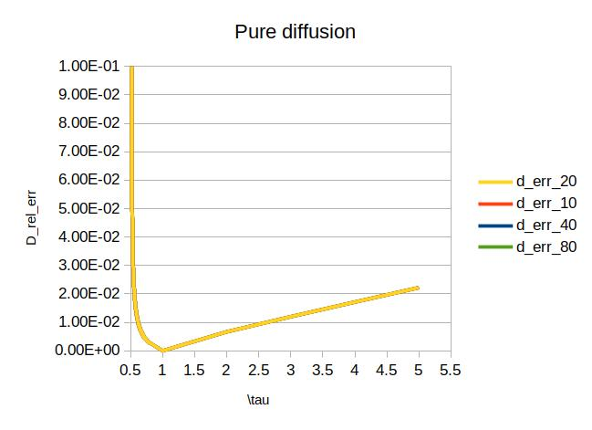
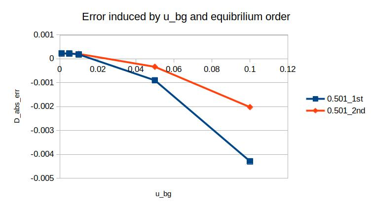
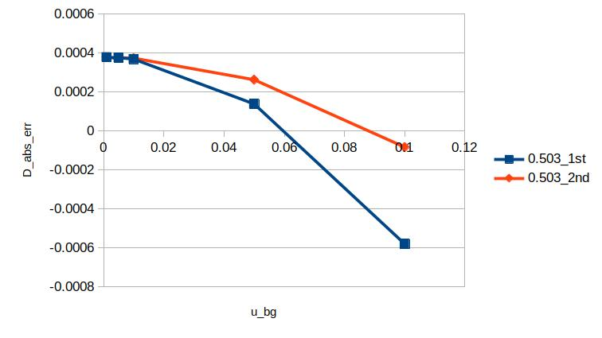
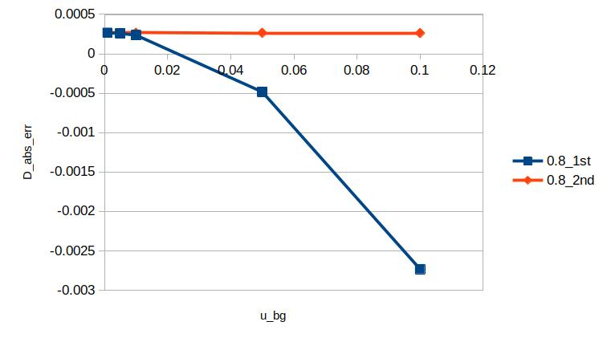
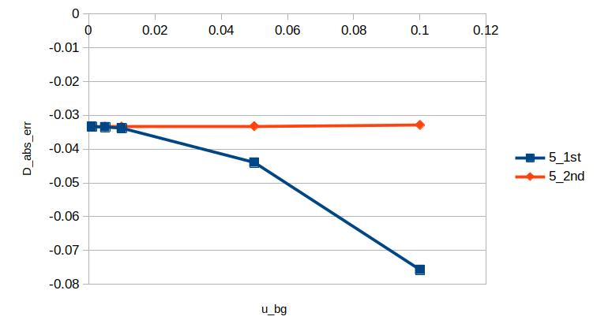
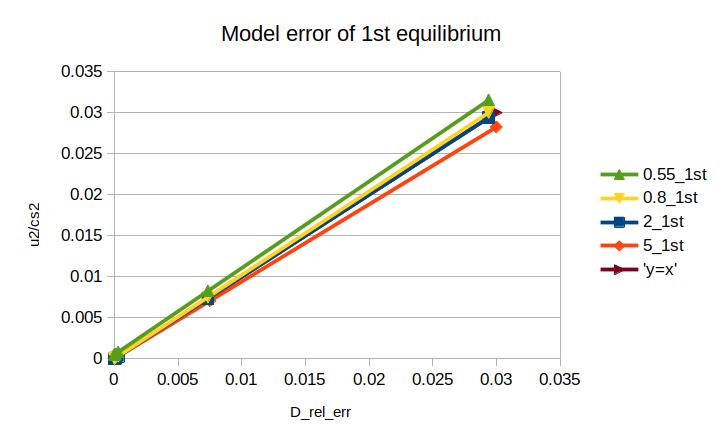

title: Advection-diffusion of a Gaussian Hill
@warning WORK IN PROGRESS @endwarning

# Advection-diffusion of a Gaussian Hill # {#eg_GPP}

In this example, we will simulate the time evolution of a Gaussian hill 
in an infinite space with periodic boundaries.
The initial form of the Gaussian pulse gives the form: 
  $$ C(\mathbf{x}, t=0) = C_0 \exp\left(-\frac{(\mathbf{x} 
  - \mathbf{x}_0)^2}{2\sigma_0^2}\right) + C_{base} $$
The analytical solution with time is:
    $$ C(\mathbf{x}, t) = \frac{\sigma_0^2}{\sigma_0^2 + \sigma_D^2} C_0 \exp \left( 
    -\frac{(\mathbf{x} - \mathbf{x}_0)^2}{2(\sigma_0^2 + \sigma_D^2)} \right) + C_{base} $$

In our simulation, $\sigma_0=40$ is used as a default value. A 1000*1000 2D mesh is recognized
 here as an infinite area, and the D2Q9 layout is used. Boundaries from all directions are 
 periodic. As the area is much larger than the $ \sigma_0 $, the effect from the boundaries 
 is neglected. Results of t=200 are used to calculate the diffusion factor.

The objectives of this example is to introduce how to:
* Simulate time evolution of the advection-diffution process of a 2D 
Gaussian Hill.
* Compare the profile between first and second order bgk equilibria
* Compare the profile between bgk and trt schemes
* Compute the diffusion parameter and compare it to the theoritical value for different 
background velocities

