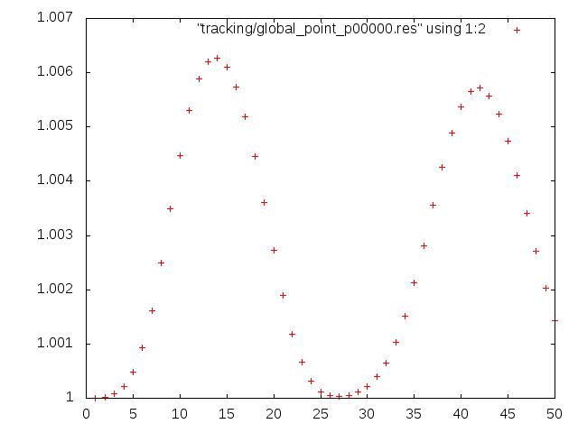

title: Configuration
@warning WORK IN PROGRESS @endwarning

Navigate: [&larr; Prerequisites](tut_00_prerequisites.html)
| [Overview](index.html)
| [Toolchain &rarr;](tut_02_mus_toolchain.html)

# Configuration
Set up your first simulation with *Musubi*.

This tutorial is using a 1D gaussian_pulse in pressure computed in a 3D domain.
The necessary configuration file to run this case will be generated from
scratch within this tutorial. An example of a final config-file for this case
can be found in `examples/tutorial/tutorial_cases/tutorial_gaussianPulse/`.

## The musubi.lua File ##

As a user, your best way to communicate with *Musubi* is a Lua-Script that
tells *Musubi* what you want to simulate and which options you want to choose.
The Lua-syntax is fairly easy, and for this tutorial, we will use only a
small subset of it, so don't be afraid if you hear of Lua for the first time.

By default, *Musubi* looks for a file called `musubi.lua` inside your current
working directory. If you want, you can use different names (for example if
you want to keep more than one script e.g. `musubi_test.lua`) and pass the name
of the script you want the application to use as a command-line argument.
(e.g.`~/apes/musubi/build/musubi musubi_test.lua`)

We are now going to build a working, almost-minimal `musubi.lua` file
step-by-step.
Please navigate to your simulation directory, and create a new file called
`musubi.lua` with your favorite text editor.

@note Most configuration options have some sane defaults, which allows you to
leave them alone if they are not relevant to you.

@note Before you run the following simulation setup, make sure that you have
created the directories `restart` and `tracking` in the same path where
`musubi.lua` is located.

## General Simulation Name ##

Moreover, every simulation should have a name,
which is specified by a variable called `simulation_name`.

In this example, we will simulate a
[Gaussian pulse](http://en.wikipedia.org/wiki/Gaussian_function 'Wikipedia: Gaussian Pulse')
in pressure, hence the name *Gausspulse* seems adequate.
You can use just anything as a simulation name, just make it clear and
descriptive, as it will help you to identify produced results from the
simulation.

@note The simulation name will appear in all output files, so if you use good
and unique names, you always know where a particular output came from.

```lua
simulation_name = 'Gausspulse'
```

## The fluid and Physics Table ##

### Physical and Lattice Boltzmann References ###

Next, we define the fluid properties, required for LBM simulations.
They are divided into two aspects, the physical (_phy) and the Lattice Boltzmann (LB)
values (_lat). The physical values are taken from the SI unit system which uses
standard units like kg (mass), mol (amount of substance), K (thermodynamic
temperature), m (length), s (time), A (electric current and cd (luminous
intensity). A lot of physical units are derived from this system. It is
normally used to present the solutions to scientific researches.
But for the program, it is necessary to use the numerical LB methods to gain
solutions. Therefore both unit systems are defined for *Musubi* and it is possible
to convert each other in both directions. In general, these tables look like
this:


```lua
nu_phy   = 1e-3 -- Kinematic viscosity
rho0_phy =  1.0 -- Density
vel_phy  =  1.0 -- Velocity
cs_phy   =  340 -- m/s speed of sound
```

```lua
Ma_lat  = 0.1                   -- Lattice Mach number
cs_lat  = 1/math.sqrt(3)        -- Lattice speed of sound
vel_lat = Ma_lat * cs_lat       -- Lattice velocity
dt      = dx * vel_lat/vel_phy  -- Physical timestep based on lattice values
```

@note In this example, we only need `nu_phy`, the other variables are only as
examples @endnote

`nu_phy` is the kinematic viscosity of the fluid, `rho0_phy` and `vel_phy` are
the macroscopic density and velocity. The kinematic viscosity needs to be given
inside the table called `fluid`, most times the bulk_viscosity is also needed.
(Lua has a single neat concept [tables](http://www.lua.org/pil/2.5.html) for
representing multiple data in a structure. It allows you to treat variables a
bit like trees: they can contain more variables, other tables, or even
references to functions.) Tables are denoted by curly braces in Lua. Thus the
configuration file for these options looks so far as follows:

```lua
fluid = {
  kinematic_viscosity =     nu_phy,
  bulk_viscosity      = 2/3*nu_phy
}
```

@note `nu_phy` is an global lua variable name and might change within different
config files (the default should be nu_phy). The entries kinematic_viscosity
and bulk_viscosity are part of the lua table and must not be changed! @endnote

## Time Settings ##

Now we should specify the number of timesteps for our simulation.
We do this by opening a `time` section with at least the variable `max`
given to specify the maximal number of timesteps you want to simulate.
Additionally, you might provide the `interval`-setting, that controls the
debug output: after a predefinded number of iterations, the total density of
the system is calculated and written to the console, this defaults to 1.
The number of iterations can be set by using `{iter=#}` to set the number of
iterations. Alternative one can use `{sim=#}` to trigger the check after certain
timesteps in your simulation or use `{clock=#}` to trigger the check after a 
certain runtime. Since we have conservation of mass, the total density should
not change much, so if it does, it is a hint for the user that the results of
the simulation are probably wrong. Setting the interval to something around
`[max/10]` is reasonable.

```lua
sim_control = {
  time_control = {
    max = {iter=50},
    interval = {iter=5}
  }
}
```

## Identification ##

It should be followed by a part that identifies the nature of the simulation.
To this part belong the following aspects: the `layout`, the `kind` and the
`relaxation`. For now, it is not necessary to know these settings in detail.
you can choose between some values that you can look up in the
[[mus_scheme_header_module]].
If these settings are not defined, *Musubi* will use default values.
As a first example, you can set up the identify table as:

```lua
identify = {
  kind  = 'fluid',
  layout = 'd3q19',
  relaxation = 'bgk',
}
```

## Geometry ##

The geometry is usually a more complicated thing to define. For anything
but the simplest case, we need *Seeder*, a tool that will be dealt with
in the [next tutorial chapter](tut_02_mus_toolchain.html).
For now, we will use a pre-defined geometry, which is just a simple cube
with periodic boundaries and no obstacles. We can specify the `length`
and position (`origin`) of that cube. The position of the cube is only
relevant if you specify positions of other objects, too, such as
initial conditions or *trackers* (we will explain what that is in
[chapter_03](tut_03_tracking.html)).

Last but not least, the `refinementLevel` tells *Musubi* how fine the
initial `cube` (with a length of 10 here) needs to be discretized. A refinement
level of `4` means that our initial cube is cut into \( 2^4 \) portions in
each dimension, which leaves us with \( 2^{3\cdot4} \) cells in `3` dimensions.

```lua
mesh = {
  predefined = 'cube',
  origin = { 0.0, 0.0, 0.0 },
  length = 10.0,
  refinementLevel = 4
}
```

@warning Lua is case-sensitve, and some *Musubi* options (like `refinementLevel`)
have to be written in camelCase.

## Tracking ##

Of course you do not only want to simulate, you also want to see results.
The `tracking` section is your way to control some subset output from *Musubi*.
The idea behind it is that for any real-life scale problem, you just
cannot save all the information of every point at every timestep,
since the shear amount of data would be too much to handle. Thus, we
tell *Musubi* what we want to see (like pressure, velocity...), at what
time, and in what position.

Each output is handled by a *tracker*. Let us define a *tracker* now, step
by step.
First, a *tracker* has a name (specified in `label`) that will appear in
every output file created by this *tracker*. Anything that is precise and
meaningful will do.

```lua
tracking = {
  label = 'track_pressure',
```

Next, we should tell the *tracker* what we are interested in. The `variable`
section will do just that for us. In this example, we will ask the *tracker*
to store density and velocity information for us.

The output will be stored on your hard drive, in the location you specify
in `folder`.

@warning You have to create the folder yourself *before* you start the
simulation. If it doesn't exist, *Musubi* will crash with a Fortran runtime error.

```lua
  variable = { 'pressure', 'velocity' },
  folder = './tracking/',
```

The most complicated part is the [[tem_shape_module]] variable.
It defines *where* inside
the simulation domain (which is a cube in our example) you want to observe the
variables. You can take samples at a point, along a line, everywhere on a plane,
or even everywhere inside a given box. These options will be discussed in more
depth in [chapter_03](tut_03_tracking.html).
For now, we are happy with a point at position `(1,1,1)`:

```lua
  shape = {
    kind = 'canoND',
    object = {origin = {1.0, 1.0, 1.0} }
  },
```

The `format` option lets you choose the file format in which the data
should be stored. The options you have are `ascii`, `asciiSpatial` and `vtk`.
`Ascii` is only really usable for point *trackers*. For anything more
sophisticated (starting in the next chapter), we will use the build-in tool
`mus_harvesting` for post-processing the data.

```lua
  output = {format = 'ascii'},
```

Finally, we have to specify at which timesteps we want to save data.
Inside the `time` section, you can specify the first (`min`) and last
(`max`) timestep that is of interest to you. If `[max]` is negative,
every timestep till the end will be considered. In `interval`, you can
choose if you want to save every timestep (set it to `1` then) or only
every `[n]`-th timestep (set `interval` to `n` in this case).
<!-- anchor to jump up here from result -->
<div id="track_control"></div>
```lua
  time_control = { min = {iter=1}, max = {iter=50}, interval = {iter=1} },
}
```
Don't forget to close the `tracking` section with another curly brace.

## Restart ##

In the `restart` part of your `musubi.lua` file you can create so-called restart
files in order to save the results of your simulation. With these restart files
you can create vtk files with `mus_harvesting` to view them in Paraview. In
addition to that, you can also read the restart files to go on with your
simulation beginning at the saved point written in the restart files. In the
"restart" section you are also able to use `time_control` to define the `min`,
`max` and the `interval` time, when *Musubi* writes a restart file to the
`restart/` folder. Be sure that you set up useful definitions for that. For
example, you can set up the restart settings like this:

```lua
restart = {
  write = 'restart/',   -- prefix to write the files to
  time_control = { min = 0, max = 10, interval = 10}  -- timing definitions (either iterations or simulation time)
}
```
@note You have to create the `restart` folder within your simulation folder at
first.
So far, these are only basic information about `restart`.
Further information about the restart are explained in
[Tutorial 5: Restart](tut_05_restart.html).

## Initial Conditions ##
Initial conditions can be specified in the `initial_condition` table.
First, let us define that the velocity at `t=0` should be `0` everywhere.

But if every point is equal, not much is going to happen. So for the
initial pressure, we will do something more fancy: We will define a function
`gausspulse` that will set the initial pressure such that it has a peak
in the middle of the domain, and decreases quickly towards the sides.
With this, we will create two waves running from the center towards both
sides. The `initial_condition`-table will point to this function for the
density:

```lua
initial_condition = {
  velocityX = 0.0,
  velocityY = 0.0,
  velocityZ = 0.0,
  pressure  = gausspulse
}
```
The function can be defined like this in the Lua script:
```lua
function gausspulse(x, y, z)
  originX =  5.0
  halfwidth = 1.0
  amplitude = 0.01
  return p0+amplitude*math.exp(-0.5/(halfwidth^2)*( x - originX )^2)
end
```
@warning Define the function before the `initial_condition` table or you will receive an error whilst
running *Musubi*.

Moreover,define the `p0` as global variable in the function.
So that it will return the function like `p0+amplitude*math.exp(-0.5/halfwidth^2)*(x-originX)^2`:

```lua
rho0 = 1.
cs2 = 1./3.
p0 = rho0*cs2
```

@note A last short remark on variables: If you do something more complicated
in your `musubi.lua` script, you are of course free to use functions,
variables, loops, branches, whatever you want.
The only thing that counts is what is defined after running your script.
Be careful, however, when using your own variables, as you might set *Musubi*
options that you are not aware of.
It might be wise to use variables only inside your own functions,
or at least give them some prefix so you don't confuse your own variables
with *Musubi* options.

## Result ##

If you did all steps correct you're now able to run the test case. If something
is not working you can compare your config file with our template you can find
under: `examples/tutorial_cases/gaussianPulse/musubi.lua`.
After finishing your run, you will find an output file called
`Gausspulse_track_pressure_p00000.res` in your `tracking`-folder.
If you open it, you will find densities and velocities for every iteration.
If you choose an other `interval` in [tracking-table](#track_control)
(for example `iter=5`), the values for every choosen iteration
(e.g. every 5th iteration) will be listed here.

@note The Ascii output is used only in this first tutorial. You can visualize
this data with any program you like, for example with
[Gnuplot](http://www.gnuplot.info), if you
have it installed. If not, wait for the next chapter, as we are going to
introduce different tools there, anyway.
Simply run Gnuplot with:

```sh
gnuplot -p -e "plot \"tracking/Gausspulse_track_pressure_p00000.res\" using 1:2"
```
to get a plot of the pressure similar to this one:



The picture shows the pulse running through your point *tracker* several
times. This happens because of the periodic boundaries. The intensity of
the pulse decreases due to dissipation.

In the next chapter, we will learn to define more complex geometries, and
to create more sophisticated outputs.

Next chapter: [Toolchain &rarr;](tut_02_mus_toolchain.html)
