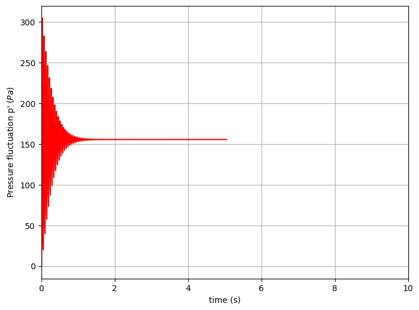
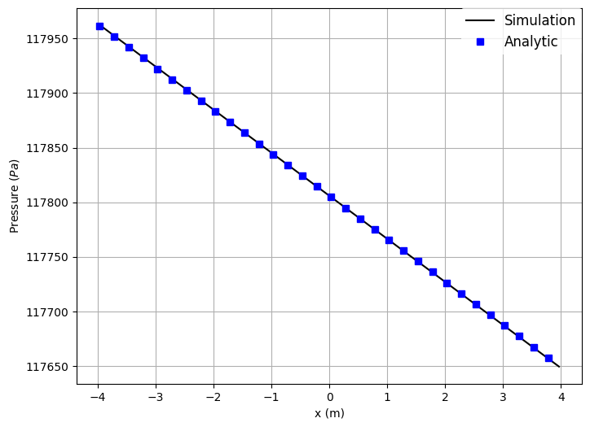

title: Tracking
@warning WORK IN PROGRESS @endwarning

Navigate: [&larr; Toolchain](tut_02_mus_toolchain.html)
| [Overview](index.html)
| [Boundary Conditions &rarr;](tut_04_boundaries.html)

# Tracking
Tracking quantities during the simulation run.

In this tutorial we deal with tracking, that is tracking flow quantities
during the simulation run and visualizing them.
> An extensive documentation of the tracking features can be found in
> [[tem_tracking_module]] and in its [documentation page](|temurl|/page/features/tracking.html)
> Two additional examples dealing with shapes are given in [[tem_shape_module:tem_load_shapes]].

In the `musubi.lua` file, there has to be a section called `tracking`.
In order to get a simulation output for harvester you set up some
information for each tracked quantity.
These are in general:

* label

  This defines the name of the tracked quantity.

* variable

  What variable values are tracked? (i.e. pressure, velocity)

* shape

  How does the geometry look like in the mesh? Shall it be a point
  or a line? Where is it placed? These are the questions you are
  supposed to answer here.

* time_control

  This behaves similar to the general time settings in `musubi.lua` . You have
  to define a starting and an end point for the tracked quantity. In addition
  to that, you must give *Musubi* information about the time interval, when
  i.e. the pressure gets its values during the simulation.

* format

   You can choose between these three formats:

  * vtk

    This format creates results in the *Treelm* format. It is used to process
    input files for Paraview. When using this format, make sure there is a
    directory called `output` in the simulation path.
    (This has been done in the last tutorial as well).
    Here you can see another example (planeXY) :

    

  * ascii

    This output format creates a .res file that contains the tracked quantities
    like pressure and velocity over certain timesteps. It is normally used for
    1D shapes (a single point). Nevertheless, it is possible to track the
    variable values over a 2D shape. In this case, a reduction is used. There
    are picked up certain points of the shape and they are reduced to a single
    result. The table in the resulting file is build up as following.
    In the first column, you can find the time (t_0, t_1, t_2, ..., t_n). It is
    followed by the variable values. Every row replaces one timestep with values
    for each variable.
    Here you can see an example that is plotted by GNUplot (probeAtCenter):

    

  * asciiSpatial

    This kind of format creates not only one res. file. Moreover it creates
    one .res file for each timestep. This means, that you get a table with
    the x, y and z coordinates of the shape in the first three columns. These
    are followed by the different variable values like pressure and shear stress.
    In summary, you get all these information for each timestep in another
    file. You can plot these values as well, so that you get something like
    this (pressAlongLength):

    

* folder

  Here, you have to define the location where your resulting files shall be dumped.

Here is a demonstration example of how a tracking section in the musubi.lua file
can look like:
```lua
-- probeAtCenter
tracking = {
  {
  label = 'probePressure',
 variable = {'pressure_phy'},
 shape = {kind = 'canoND', object = {origin ={0.0,0.,0.} } },
 time_control = {min = {iter=1}, interval = {iter=1}},
  output = {format = 'ascii'}, folder = './tracking/'
 }
}
```

You have to define your variable values first before you can track them. Have a look [here](|temurl|/page/features/variables/index.html) on how to do this.

Here ends the tutorial for tracking quantities during the simulation. You can go on for
more information about boundary conditions in the next tutorial.

Next chapter: [Boundary Conditions &rarr;](tut_04_boundaries.html)
